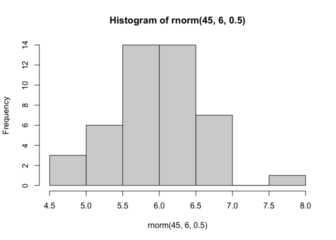
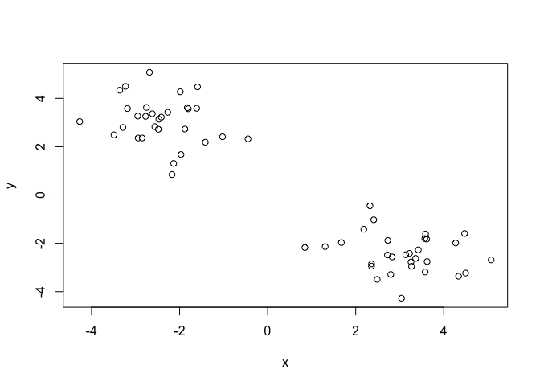
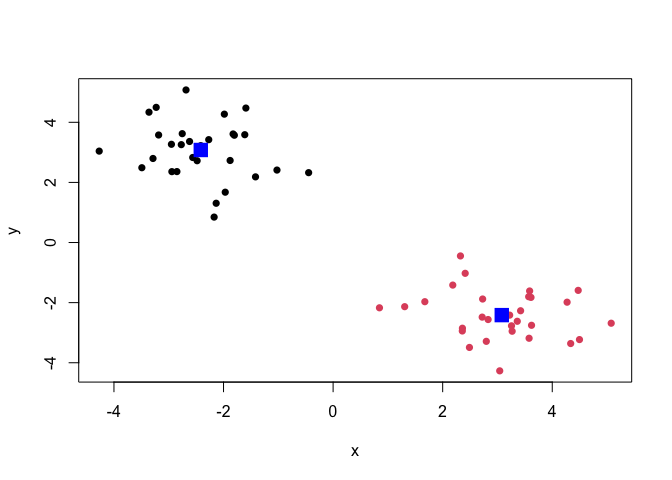
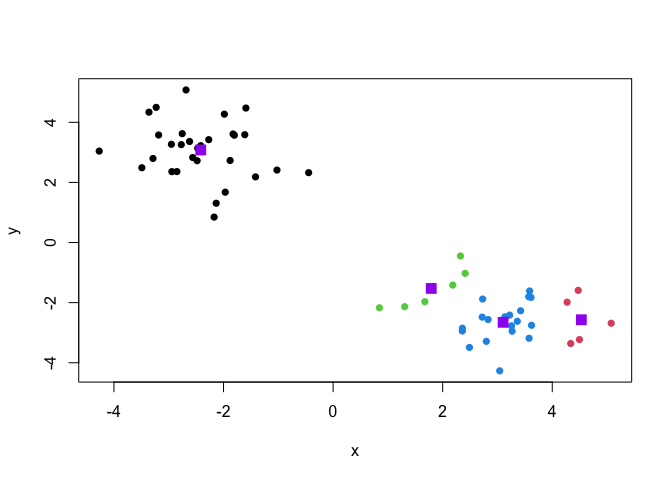
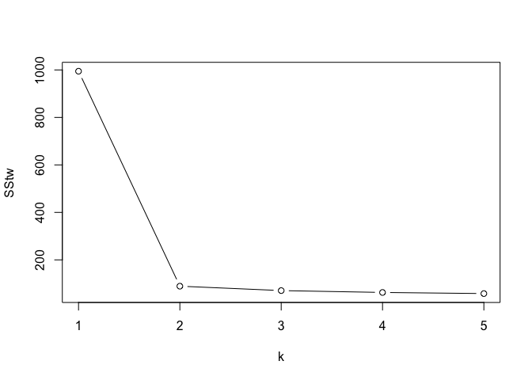
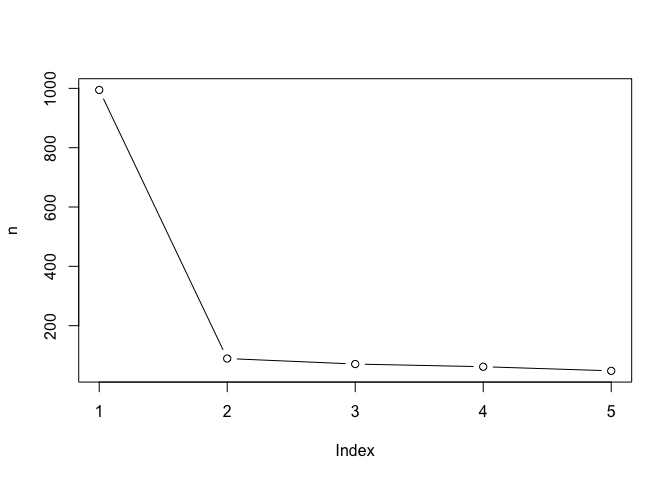
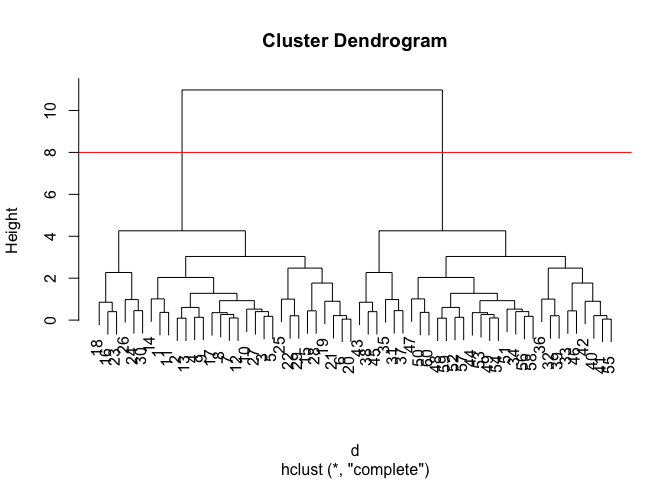
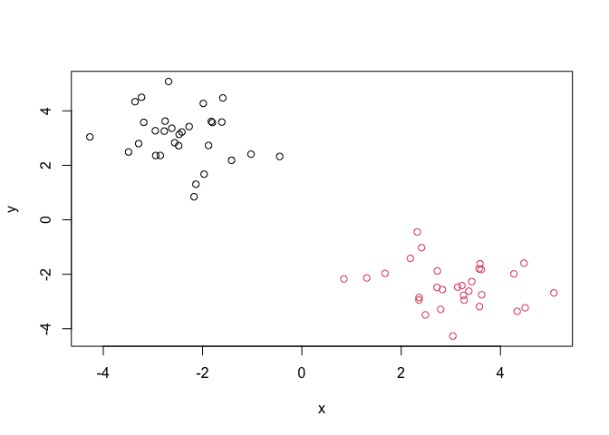
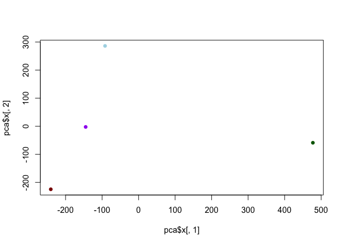
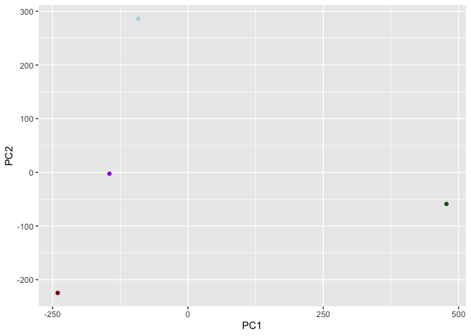

# Class_07_lab
Tessa Sterns PID: 18482353

An introductory exploration of machine learning. Starting with
clustering and dimensionality reduction.

## k-means clustering

Using generated data from the `rnorm()` function with known clustering
we can explore how the clustering works.

``` r
rnorm(20, 5, 2)
```

     [1] 1.4292876 6.7961899 5.2257123 2.1767973 7.0856067 7.3322480 4.5139424
     [8] 0.6512532 2.2819607 1.1468631 4.8104956 4.0053850 8.1514426 5.5162025
    [15] 1.2645673 3.7873085 8.1452307 5.3873339 6.1635737 5.6568922

``` r
hist(rnorm(45, 6, 0.5))
```



``` r
x <- c(rnorm(30, -3),
rnorm(30, 3))

y <- rev(x)

z <- cbind(x,y)

plot(z)
```



In base R the function `kmeans()` can do k-means clustering.

``` r
km <- kmeans(z, 2)
```

To retreive the results from a returned list object use the `$` syntax

> Q1 How many points are in each cluster?

``` r
km$size
```

    [1] 30 30

> Q2 What is the cluster asignment?

``` r
km$cluster
```

     [1] 1 1 1 1 1 1 1 1 1 1 1 1 1 1 1 1 1 1 1 1 1 1 1 1 1 1 1 1 1 1 2 2 2 2 2 2 2 2
    [39] 2 2 2 2 2 2 2 2 2 2 2 2 2 2 2 2 2 2 2 2 2 2

> Q3 Where are the cluster centers?

``` r
km$centers
```

              x         y
    1 -2.415202  3.078670
    2  3.078670 -2.415202

> Q4 Make a clustering results figure of the data colored by cluster
> mebership and show cluster centers?

``` r
plot(z, col = km$cluster, pch = 16)
points(km$centers, col="blue", pch = 15, cex = 2)
```



k-means clustering is popular, very fast and strait forward to use,
taking numeric data as input and returns cluster membership vector.
However you need to already know how many clusters exist in the data
set.

> Q5 Run k-means again with four groups and plot results?

``` r
km4 <- kmeans(z, 4)
plot(z, col = km4$cluster, pch = 16)
points(km4$centers, col="purple", pch = 15, cex = 1.5)
```



generating a Scree plot brute-force method

``` r
km3 <- kmeans(z, 3)
km5 <- kmeans(z, 5)
km1 <- kmeans(z, 1)

SStw <- c(km1$tot.withinss, km$tot.withinss, km3$tot.withinss, km4$tot.withinss, km5$tot.withinss)
k <- c(1,2,3,4,5)
plot(k, SStw, type = "b")
```



`for` loop to generate a Scree plot, more elegant code for when brute
force is unreasonable.

``` r
n <- NULL
for(i in 1:5) {
  n <- c(n, kmeans(z, centers = i)$tot.withinss)
}
plot(n, type = "b")
```



## Hierarchical Clustering

The main “base” function is `hclust()`. Here we can’t imput raw data,
need to generate a distance matrix using `dist()` function.

``` r
d <- dist(z)
hc <- hclust(d)
hc
```


    Call:
    hclust(d = d)

    Cluster method   : complete 
    Distance         : euclidean 
    Number of objects: 60 

There is a plot method for hclust which will return a dendrogram.

``` r
plot(hc)
abline(h=8, col = "red")
```



To retrieve our cluster membership vecter we can use `cutree` at a given
hieght ‘h =’ or groups ‘k =’.

``` r
grps <- cutree(hc, h = 8)
```

> Q6 Plot the data with our hclust result coloring.

``` r
plot(z, col = grps)
```



## Dimensionality reduction, (PCA) Principal Component Analysis

Principle components are new axis that are closest to the observations.
The can capture more of the spread of the data. Usefull for identifying
outliers and trends in the data.

# Part 2 PCA

## PCA of UK food data

``` r
url <- "https://tinyurl.com/UK-foods"
x <- read.csv(url)
```

> Q1 How many rows and colums are in this data set?

``` r
dim(x)
```

    [1] 17  5

``` r
head(x)
```

                   X England Wales Scotland N.Ireland
    1         Cheese     105   103      103        66
    2  Carcass_meat      245   227      242       267
    3    Other_meat      685   803      750       586
    4           Fish     147   160      122        93
    5 Fats_and_oils      193   235      184       209
    6         Sugars     156   175      147       139

``` r
rownames(x) <- x[,1]
x <- x[,-1]
head(x)
```

                   England Wales Scotland N.Ireland
    Cheese             105   103      103        66
    Carcass_meat       245   227      242       267
    Other_meat         685   803      750       586
    Fish               147   160      122        93
    Fats_and_oils      193   235      184       209
    Sugars             156   175      147       139

``` r
# an easier way is to read in the row names in the first place, x <- read.csv(url, row.names=1)
head(x)
```

                   England Wales Scotland N.Ireland
    Cheese             105   103      103        66
    Carcass_meat       245   227      242       267
    Other_meat         685   803      750       586
    Fish               147   160      122        93
    Fats_and_oils      193   235      184       209
    Sugars             156   175      147       139

``` r
dim(x)
```

    [1] 17  4

> Q2. Which approach to solving the ‘row-names problem’ mentioned above
> do you prefer and why? Is one approach more robust than another under
> certain circumstances?

reading in the code properly the first time makes it so we don’t
accidentally remove extra collums.

``` r
barplot(as.matrix(x), beside=T, col=rainbow(nrow(x)))
```


> Q3: Changing what optional argument in the above barplot() function
> results in the following plot?

beside = F

``` r
barplot(as.matrix(x),  col=rainbow(nrow(x)))
```


> Q5: Generating all pairwise plots may help somewhat. Can you make
> sense of the following code and resulting figure? What does it mean if
> a given point lies on the diagonal for a given plot?

``` r
pairs(x, col=rainbow(10), pch=16)
```


This code can generate all columns against each other. If they are on
the diagonal then the countries eat the same amount of a given food.

> Key takeaway: It is rather difficult to spot the major trends and
> patterns even in relativly small datasets. This would be absolutly
> useless with large datasets.

## PCA to save the day

The main function in “base” R for PCA is `prcomp()`. Transpose `t()` of
the data set, rows become columns and columns become rows.

``` r
pca <- prcomp( t(x) )
summary(pca)
```

    Importance of components:
                                PC1      PC2      PC3       PC4
    Standard deviation     324.1502 212.7478 73.87622 2.921e-14
    Proportion of Variance   0.6744   0.2905  0.03503 0.000e+00
    Cumulative Proportion    0.6744   0.9650  1.00000 1.000e+00

Base R plot

``` r
cols <- c("purple", "darkred", "lightblue", "darkgreen")
plot(pca$x[,1], pca$x[,2], col = cols, pch =16)
```



This shows that N.Ireland is different than the other groups.

However we can make a better graph

``` r
library(ggplot2)
```

    Warning: package 'ggplot2' was built under R version 4.5.2

``` r
ggplot(pca$x) +
  aes(PC1, PC2) +
  geom_point(col = cols)
```



Finding out the specific foods that are contributes to the PC axis.

``` r
pca$rotation
```

                                 PC1          PC2         PC3          PC4
    Cheese              -0.056955380  0.016012850  0.02394295 -0.409382587
    Carcass_meat         0.047927628  0.013915823  0.06367111  0.729481922
    Other_meat          -0.258916658 -0.015331138 -0.55384854  0.331001134
    Fish                -0.084414983 -0.050754947  0.03906481  0.022375878
    Fats_and_oils       -0.005193623 -0.095388656 -0.12522257  0.034512161
    Sugars              -0.037620983 -0.043021699 -0.03605745  0.024943337
    Fresh_potatoes       0.401402060 -0.715017078 -0.20668248  0.021396007
    Fresh_Veg           -0.151849942 -0.144900268  0.21382237  0.001606882
    Other_Veg           -0.243593729 -0.225450923 -0.05332841  0.031153231
    Processed_potatoes  -0.026886233  0.042850761 -0.07364902 -0.017379680
    Processed_Veg       -0.036488269 -0.045451802  0.05289191  0.021250980
    Fresh_fruit         -0.632640898 -0.177740743  0.40012865  0.227657348
    Cereals             -0.047702858 -0.212599678 -0.35884921  0.100043319
    Beverages           -0.026187756 -0.030560542 -0.04135860 -0.018382072
    Soft_drinks          0.232244140  0.555124311 -0.16942648  0.222319484
    Alcoholic_drinks    -0.463968168  0.113536523 -0.49858320 -0.273126013
    Confectionery       -0.029650201  0.005949921 -0.05232164  0.001890737

``` r
ggplot(pca$rotation) +
  aes(PC1, rownames(pca$rotation)) +
  geom_col()
```


PCA can be a useful tool to visualize differences in large data sets.

> Q6. What is the main differences between N. Ireland and the other
> countries of the UK in terms of this data-set?

N. Ireland consumes more potatos, soft drinks and less fresh fruit,
meat, alcohol than the rest of the UK.
