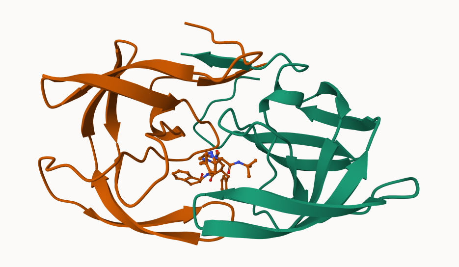
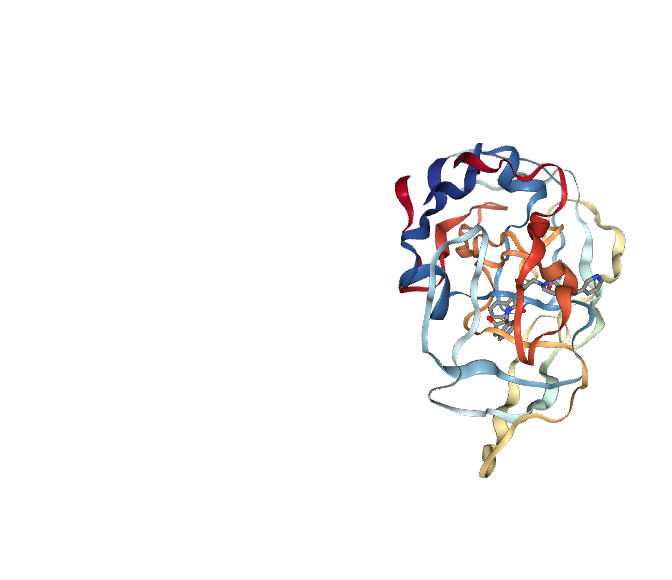
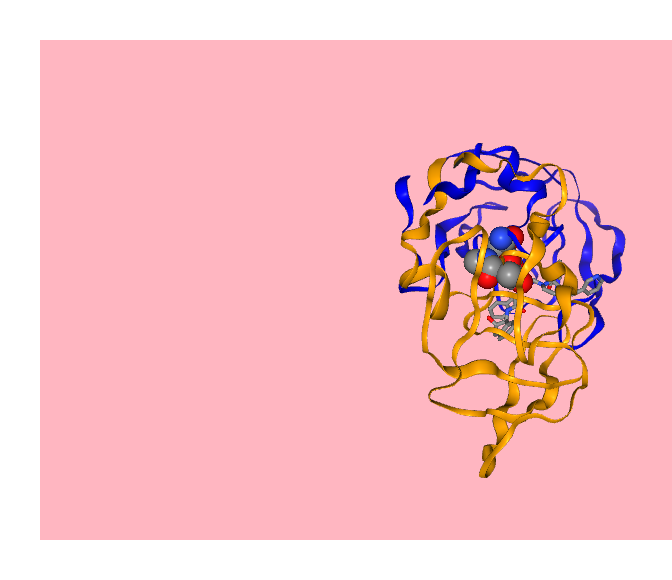
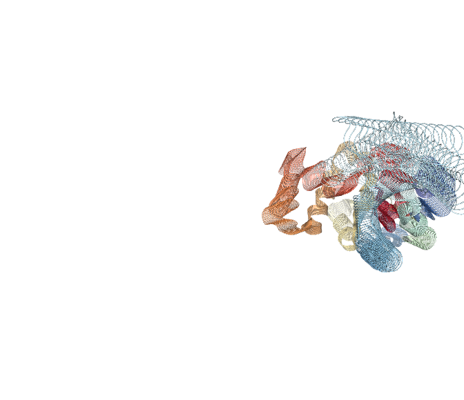
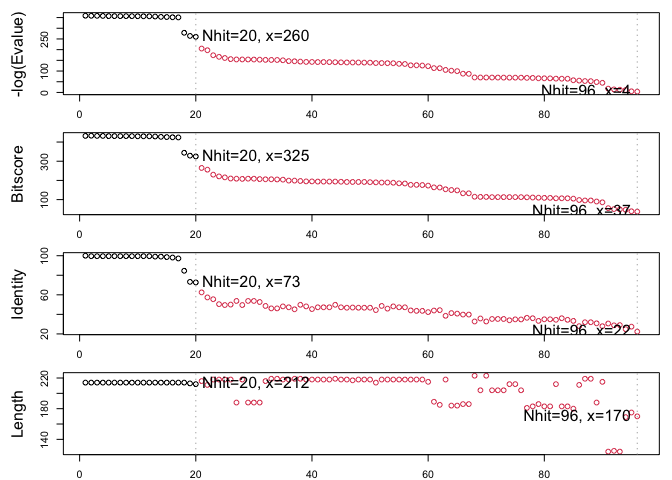
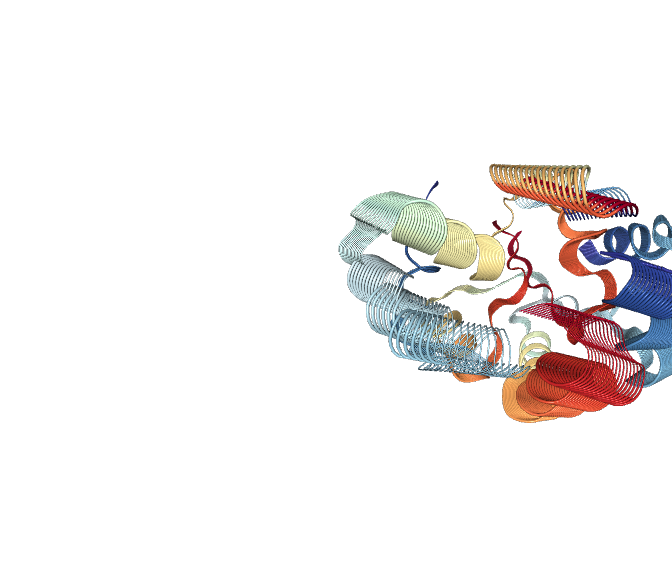
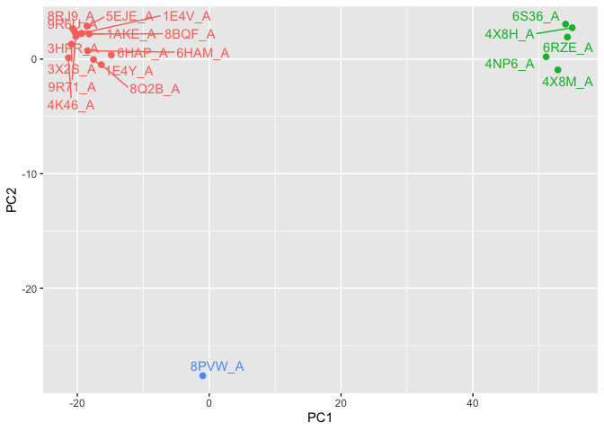
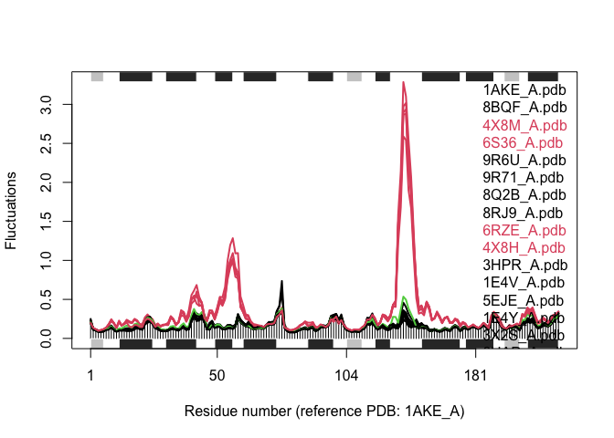

# Class_09_lab
Tessa Sterns PID: A18482353

- [Exploring PDB structures](#exploring-pdb-structures)
- [PDB objects in R](#pdb-objects-in-r)
- [Predicting functional motions of a single
  structure](#predicting-functional-motions-of-a-single-structure)
- [Comparative structure analysis of Adenylate
  Kinase](#comparative-structure-analysis-of-adenylate-kinase)
- [Annotate collected PDB
  structures](#annotate-collected-pdb-structures)
- [Principal component analysis](#principal-component-analysis)
- [Optional further visualization](#optional-further-visualization)
- [Normal mode analysis](#normal-mode-analysis)

The PDB is the main databank for protein structures.

``` r
library(readr)
```

    Warning: package 'readr' was built under R version 4.5.2

``` r
ps.data <- read_csv("Data Export Summary.csv")
# if only using one function can write as 
#'readr: :read_csv()`
```

``` r
sum(ps.data$Total)
```

    [1] 243910

``` r
p.xray <- round((sum(ps.data$`X-ray`)/sum(ps.data$Total))*100, 2)
p.EM <- round((sum(ps.data$EM)/sum(ps.data$Total))*100,2)

Tot.p <- round((ps.data[1,9, drop = TRUE] / sum(ps.data$Total))*100,2)
```

> Q1: What percentage of structures in the PDB are solved by X-Ray and
> Electron Microscopy.

There have been 81.48% solved by X-ray and 12.22% solved by electron
microscopy.

> Q2: What proportion of structures in the PDB are protein?

There are 86.05 % of the total data set are proteins.

> Q3: Type HIV in the PDB website search box on the home page and
> determine how many HIV-1 protease structures are in the current PDB?

There are 1150 structures of the HIV-1 protease in the current PDB.

## Exploring PDB structures

package for structural bioinformatics - bio3d

``` r
library(bio3d)

hiv <- read.pdb(file = "1hsg")
```

      Note: Accessing on-line PDB file

Using Mol\* veiwer to explore 1HSG structure.



> Q4: Water molecules normally have 3 atoms. Why do we see just one atom
> per water molecule in this structure?

They are just showing the oxygen which is the larger and more
electronegative atom in water. One reason for this is to make it easier
to visualize. Similar to how we don’t show all the molecules of water
because if we did it would be difficult to see the protein.

> Q5: There is a critical “conserved” water molecule in the binding
> site. Can you identify this water molecule? What residue number does
> this water molecule have

This water molecule is HOH 308. It is participating in four hydrogen
bonds, 2 with the ligand and 2 with the HIV-1 protease.

> Q6: Generate and save a figure clearly showing the two distinct chains
> of HIV-protease along with the ligand. You might also consider showing
> the catalytic residues ASP 25 in each chain and the critical water (we
> recommend “Ball & Stick” for these side-chains). Add this figure to
> your Quarto document.

A view of HIV-1 protease with catalytic residues in space filling model
and the ligand MK1 as a ball and stick model.


> Discussion Topic: Can you think of a way in which indinavir, or even
> larger ligands and substrates, could enter the binding site?

Because proteins are dynamic it is likely that when not bound by a
ligand the HIV-1 protease is in a more open configuration and then
conforms to fit the ligind upon interaction.

> Q7: \[Optional\] As you have hopefully observed HIV protease is a
> homodimer (i.e. it is composed of two identical chains). With the aid
> of the graphic display can you identify secondary structure elements
> that are likely to only form in the dimer rather than the monomer?

There is an antiparalel beta-sheet that is formed by a beta-strand from
each of the monomers. Additionally the binding pocket itself rests in
the middle of the two chains.

## PDB objects in R

``` r
head(hiv$atom)
```

      type eleno elety  alt resid chain resno insert      x      y     z o     b
    1 ATOM     1     N <NA>   PRO     A     1   <NA> 29.361 39.686 5.862 1 38.10
    2 ATOM     2    CA <NA>   PRO     A     1   <NA> 30.307 38.663 5.319 1 40.62
    3 ATOM     3     C <NA>   PRO     A     1   <NA> 29.760 38.071 4.022 1 42.64
    4 ATOM     4     O <NA>   PRO     A     1   <NA> 28.600 38.302 3.676 1 43.40
    5 ATOM     5    CB <NA>   PRO     A     1   <NA> 30.508 37.541 6.342 1 37.87
    6 ATOM     6    CG <NA>   PRO     A     1   <NA> 29.296 37.591 7.162 1 38.40
      segid elesy charge
    1  <NA>     N   <NA>
    2  <NA>     C   <NA>
    3  <NA>     C   <NA>
    4  <NA>     O   <NA>
    5  <NA>     C   <NA>
    6  <NA>     C   <NA>

Extract the sequence

``` r
pdbseq(hiv)
```

      1   2   3   4   5   6   7   8   9  10  11  12  13  14  15  16  17  18  19  20 
    "P" "Q" "I" "T" "L" "W" "Q" "R" "P" "L" "V" "T" "I" "K" "I" "G" "G" "Q" "L" "K" 
     21  22  23  24  25  26  27  28  29  30  31  32  33  34  35  36  37  38  39  40 
    "E" "A" "L" "L" "D" "T" "G" "A" "D" "D" "T" "V" "L" "E" "E" "M" "S" "L" "P" "G" 
     41  42  43  44  45  46  47  48  49  50  51  52  53  54  55  56  57  58  59  60 
    "R" "W" "K" "P" "K" "M" "I" "G" "G" "I" "G" "G" "F" "I" "K" "V" "R" "Q" "Y" "D" 
     61  62  63  64  65  66  67  68  69  70  71  72  73  74  75  76  77  78  79  80 
    "Q" "I" "L" "I" "E" "I" "C" "G" "H" "K" "A" "I" "G" "T" "V" "L" "V" "G" "P" "T" 
     81  82  83  84  85  86  87  88  89  90  91  92  93  94  95  96  97  98  99   1 
    "P" "V" "N" "I" "I" "G" "R" "N" "L" "L" "T" "Q" "I" "G" "C" "T" "L" "N" "F" "P" 
      2   3   4   5   6   7   8   9  10  11  12  13  14  15  16  17  18  19  20  21 
    "Q" "I" "T" "L" "W" "Q" "R" "P" "L" "V" "T" "I" "K" "I" "G" "G" "Q" "L" "K" "E" 
     22  23  24  25  26  27  28  29  30  31  32  33  34  35  36  37  38  39  40  41 
    "A" "L" "L" "D" "T" "G" "A" "D" "D" "T" "V" "L" "E" "E" "M" "S" "L" "P" "G" "R" 
     42  43  44  45  46  47  48  49  50  51  52  53  54  55  56  57  58  59  60  61 
    "W" "K" "P" "K" "M" "I" "G" "G" "I" "G" "G" "F" "I" "K" "V" "R" "Q" "Y" "D" "Q" 
     62  63  64  65  66  67  68  69  70  71  72  73  74  75  76  77  78  79  80  81 
    "I" "L" "I" "E" "I" "C" "G" "H" "K" "A" "I" "G" "T" "V" "L" "V" "G" "P" "T" "P" 
     82  83  84  85  86  87  88  89  90  91  92  93  94  95  96  97  98  99 
    "V" "N" "I" "I" "G" "R" "N" "L" "L" "T" "Q" "I" "G" "C" "T" "L" "N" "F" 

> Q7: How many amino acid residues are there in this pdb object?

There are 198 amino acid residues in this pdb object.

``` r
library(dplyr)
```


    Attaching package: 'dplyr'

    The following objects are masked from 'package:stats':

        filter, lag

    The following objects are masked from 'package:base':

        intersect, setdiff, setequal, union

``` r
non.p <- hiv$atom %>% 
  filter(resid == "MK1")
table(non.p$resid)
```


    MK1 
     45 

> Q8: Name one of the two non-protein residues?

One of the non-protein residues is MK1 which is the ligind designed to
inhibit the protease.

> Q9: How many protein chains are in this structure?

There are two chains in this structure an alpha and a beta.

Need the **bio3dview** package installed in the console first.

``` r
library(bio3dview)

view.pdb(hiv)
```

    file:////private/var/folders/vr/dj7chnl94lv5g8p28r0c72b00000gn/T/Rtmp2wjGUH/file158e1510eab6/widget158e9a15d88.html screenshot completed



``` r
hiv1.Aseq <- pdbseq(trim.pdb(hiv, chain="A"))
```

Changing some settings

``` r
sel <- atom.select(hiv, resno=25)
view.pdb(hiv,
         highlight = sel,
         highlight.style = "spacefill",
         colorScheme = "chain",
         col = c("blue", "orange"), 
         backgroundColor = "lightpink")
```

    file:////private/var/folders/vr/dj7chnl94lv5g8p28r0c72b00000gn/T/Rtmp2wjGUH/file158e240a2955/widget158e171f9def.html screenshot completed



## Predicting functional motions of a single structure

``` r
adk <- read.pdb("6s36")
```

      Note: Accessing on-line PDB file
       PDB has ALT records, taking A only, rm.alt=TRUE

``` r
#flexibility prediction
m <- nma(adk)
```

     Building Hessian...        Done in 0.008 seconds.
     Diagonalizing Hessian...   Done in 0.181 seconds.

``` r
plot(m)
```


``` r
# Molecular trajectory animation
mktrj(m, file="adk_m7.pdb")

view.nma(m, pdb=adk)
```

    file:////private/var/folders/vr/dj7chnl94lv5g8p28r0c72b00000gn/T/Rtmp2wjGUH/file158e59db1045/widget158e3d095019.html screenshot completed



## Comparative structure analysis of Adenylate Kinase

> Q10. Which of the packages above is found only on BioConductor and not
> CRAN?

The ‘BiocManager::install(“msa”)’ package is not on CRAN, the use of ‘:
:’ indecates we are downloading a package from an outside library, and
Bioc is a shortened form of Biocunductor.

> Q11. Which of the above packages is not found on BioConductor or CRAN?

The ‘pak::pak(“bioboot/bio3dview”)’ package.

> Q12. True or False? Functions from the pak package can be used to
> install packages from GitHub and BitBucket?

True

\##Search and retrieve ADK structures

``` r
aa <- get.seq("1ake_A")
```

    Warning in get.seq("1ake_A"): Removing existing file: seqs.fasta

    Fetching... Please wait. Done.

``` r
aa
```

                 1        .         .         .         .         .         60 
    pdb|1AKE|A   MRIILLGAPGAGKGTQAQFIMEKYGIPQISTGDMLRAAVKSGSELGKQAKDIMDAGKLVT
                 1        .         .         .         .         .         60 

                61        .         .         .         .         .         120 
    pdb|1AKE|A   DELVIALVKERIAQEDCRNGFLLDGFPRTIPQADAMKEAGINVDYVLEFDVPDELIVDRI
                61        .         .         .         .         .         120 

               121        .         .         .         .         .         180 
    pdb|1AKE|A   VGRRVHAPSGRVYHVKFNPPKVEGKDDVTGEELTTRKDDQEETVRKRLVEYHQMTAPLIG
               121        .         .         .         .         .         180 

               181        .         .         .   214 
    pdb|1AKE|A   YYSKEAEAGNTKYAKVDGTKPVAEVRADLEKILG
               181        .         .         .   214 

    Call:
      read.fasta(file = outfile)

    Class:
      fasta

    Alignment dimensions:
      1 sequence rows; 214 position columns (214 non-gap, 0 gap) 

    + attr: id, ali, call

> Q13. How many amino acids are in this sequence, i.e. how long is this
> sequence?

There are 214 amino acids in this sequence.

``` r
# Blast or hmmer search 
b <- blast.pdb(aa)
```

     Searching ... please wait (updates every 5 seconds) RID = K3RBMXEG014 
     ..
     Reporting 96 hits

``` r
hits <- plot(b)
```

      * Possible cutoff values:    260 3 
                Yielding Nhits:    20 96 

      * Chosen cutoff value of:    260 
                Yielding Nhits:    20 



``` r
head(hits$pdb.id)
```

    [1] "1AKE_A" "8BQF_A" "4X8M_A" "6S36_A" "9R6U_A" "9R71_A"

``` r
# Download releated PDB files
files <- get.pdb(hits$pdb.id, path="pdbs", split=TRUE, gzip=TRUE)
```

    Warning in get.pdb(hits$pdb.id, path = "pdbs", split = TRUE, gzip = TRUE):
    pdbs/1AKE.pdb.gz exists. Skipping download

    Warning in get.pdb(hits$pdb.id, path = "pdbs", split = TRUE, gzip = TRUE):
    pdbs/8BQF.pdb.gz exists. Skipping download

    Warning in get.pdb(hits$pdb.id, path = "pdbs", split = TRUE, gzip = TRUE):
    pdbs/4X8M.pdb.gz exists. Skipping download

    Warning in get.pdb(hits$pdb.id, path = "pdbs", split = TRUE, gzip = TRUE):
    pdbs/6S36.pdb.gz exists. Skipping download

    Warning in get.pdb(hits$pdb.id, path = "pdbs", split = TRUE, gzip = TRUE):
    pdbs/8Q2B.pdb.gz exists. Skipping download

    Warning in get.pdb(hits$pdb.id, path = "pdbs", split = TRUE, gzip = TRUE):
    pdbs/8RJ9.pdb.gz exists. Skipping download

    Warning in get.pdb(hits$pdb.id, path = "pdbs", split = TRUE, gzip = TRUE):
    pdbs/6RZE.pdb.gz exists. Skipping download

    Warning in get.pdb(hits$pdb.id, path = "pdbs", split = TRUE, gzip = TRUE):
    pdbs/4X8H.pdb.gz exists. Skipping download

    Warning in get.pdb(hits$pdb.id, path = "pdbs", split = TRUE, gzip = TRUE):
    pdbs/3HPR.pdb.gz exists. Skipping download

    Warning in get.pdb(hits$pdb.id, path = "pdbs", split = TRUE, gzip = TRUE):
    pdbs/1E4V.pdb.gz exists. Skipping download

    Warning in get.pdb(hits$pdb.id, path = "pdbs", split = TRUE, gzip = TRUE):
    pdbs/5EJE.pdb.gz exists. Skipping download

    Warning in get.pdb(hits$pdb.id, path = "pdbs", split = TRUE, gzip = TRUE):
    pdbs/1E4Y.pdb.gz exists. Skipping download

    Warning in get.pdb(hits$pdb.id, path = "pdbs", split = TRUE, gzip = TRUE):
    pdbs/3X2S.pdb.gz exists. Skipping download

    Warning in get.pdb(hits$pdb.id, path = "pdbs", split = TRUE, gzip = TRUE):
    pdbs/6HAP.pdb.gz exists. Skipping download

    Warning in get.pdb(hits$pdb.id, path = "pdbs", split = TRUE, gzip = TRUE):
    pdbs/6HAM.pdb.gz exists. Skipping download

    Warning in get.pdb(hits$pdb.id, path = "pdbs", split = TRUE, gzip = TRUE):
    pdbs/8PVW.pdb.gz exists. Skipping download

    Warning in get.pdb(hits$pdb.id, path = "pdbs", split = TRUE, gzip = TRUE):
    pdbs/4K46.pdb.gz exists. Skipping download

    Warning in get.pdb(hits$pdb.id, path = "pdbs", split = TRUE, gzip = TRUE):
    pdbs/4NP6.pdb.gz exists. Skipping download


      |                                                                            
      |                                                                      |   0%
      |                                                                            
      |====                                                                  |   5%
      |                                                                            
      |=======                                                               |  10%
      |                                                                            
      |==========                                                            |  15%
      |                                                                            
      |==============                                                        |  20%
      |                                                                            
      |==================                                                    |  25%
      |                                                                            
      |=====================                                                 |  30%
      |                                                                            
      |========================                                              |  35%
      |                                                                            
      |============================                                          |  40%
      |                                                                            
      |================================                                      |  45%
      |                                                                            
      |===================================                                   |  50%
      |                                                                            
      |======================================                                |  55%
      |                                                                            
      |==========================================                            |  60%
      |                                                                            
      |==============================================                        |  65%
      |                                                                            
      |=================================================                     |  70%
      |                                                                            
      |====================================================                  |  75%
      |                                                                            
      |========================================================              |  80%
      |                                                                            
      |============================================================          |  85%
      |                                                                            
      |===============================================================       |  90%
      |                                                                            
      |==================================================================    |  95%
      |                                                                            
      |======================================================================| 100%

\##Align and superpose structures

``` r
pdbs <- pdbaln(files, fit = TRUE, exefile="msa")
```

    Reading PDB files:
    pdbs/split_chain/1AKE_A.pdb
    pdbs/split_chain/8BQF_A.pdb
    pdbs/split_chain/4X8M_A.pdb
    pdbs/split_chain/6S36_A.pdb
    pdbs/split_chain/9R6U_A.pdb
    pdbs/split_chain/9R71_A.pdb
    pdbs/split_chain/8Q2B_A.pdb
    pdbs/split_chain/8RJ9_A.pdb
    pdbs/split_chain/6RZE_A.pdb
    pdbs/split_chain/4X8H_A.pdb
    pdbs/split_chain/3HPR_A.pdb
    pdbs/split_chain/1E4V_A.pdb
    pdbs/split_chain/5EJE_A.pdb
    pdbs/split_chain/1E4Y_A.pdb
    pdbs/split_chain/3X2S_A.pdb
    pdbs/split_chain/6HAP_A.pdb
    pdbs/split_chain/6HAM_A.pdb
    pdbs/split_chain/8PVW_A.pdb
    pdbs/split_chain/4K46_A.pdb
    pdbs/split_chain/4NP6_A.pdb
       PDB has ALT records, taking A only, rm.alt=TRUE
    .   PDB has ALT records, taking A only, rm.alt=TRUE
    ..   PDB has ALT records, taking A only, rm.alt=TRUE
    .   PDB has ALT records, taking A only, rm.alt=TRUE
    .   PDB has ALT records, taking A only, rm.alt=TRUE
    .   PDB has ALT records, taking A only, rm.alt=TRUE
    .   PDB has ALT records, taking A only, rm.alt=TRUE
    .   PDB has ALT records, taking A only, rm.alt=TRUE
    ..   PDB has ALT records, taking A only, rm.alt=TRUE
    ..   PDB has ALT records, taking A only, rm.alt=TRUE
    ....   PDB has ALT records, taking A only, rm.alt=TRUE
    .   PDB has ALT records, taking A only, rm.alt=TRUE
    .   PDB has ALT records, taking A only, rm.alt=TRUE
    ..

    Extracting sequences

    pdb/seq: 1   name: pdbs/split_chain/1AKE_A.pdb 
       PDB has ALT records, taking A only, rm.alt=TRUE
    pdb/seq: 2   name: pdbs/split_chain/8BQF_A.pdb 
       PDB has ALT records, taking A only, rm.alt=TRUE
    pdb/seq: 3   name: pdbs/split_chain/4X8M_A.pdb 
    pdb/seq: 4   name: pdbs/split_chain/6S36_A.pdb 
       PDB has ALT records, taking A only, rm.alt=TRUE
    pdb/seq: 5   name: pdbs/split_chain/9R6U_A.pdb 
       PDB has ALT records, taking A only, rm.alt=TRUE
    pdb/seq: 6   name: pdbs/split_chain/9R71_A.pdb 
       PDB has ALT records, taking A only, rm.alt=TRUE
    pdb/seq: 7   name: pdbs/split_chain/8Q2B_A.pdb 
       PDB has ALT records, taking A only, rm.alt=TRUE
    pdb/seq: 8   name: pdbs/split_chain/8RJ9_A.pdb 
       PDB has ALT records, taking A only, rm.alt=TRUE
    pdb/seq: 9   name: pdbs/split_chain/6RZE_A.pdb 
       PDB has ALT records, taking A only, rm.alt=TRUE
    pdb/seq: 10   name: pdbs/split_chain/4X8H_A.pdb 
    pdb/seq: 11   name: pdbs/split_chain/3HPR_A.pdb 
       PDB has ALT records, taking A only, rm.alt=TRUE
    pdb/seq: 12   name: pdbs/split_chain/1E4V_A.pdb 
    pdb/seq: 13   name: pdbs/split_chain/5EJE_A.pdb 
       PDB has ALT records, taking A only, rm.alt=TRUE
    pdb/seq: 14   name: pdbs/split_chain/1E4Y_A.pdb 
    pdb/seq: 15   name: pdbs/split_chain/3X2S_A.pdb 
    pdb/seq: 16   name: pdbs/split_chain/6HAP_A.pdb 
    pdb/seq: 17   name: pdbs/split_chain/6HAM_A.pdb 
       PDB has ALT records, taking A only, rm.alt=TRUE
    pdb/seq: 18   name: pdbs/split_chain/8PVW_A.pdb 
       PDB has ALT records, taking A only, rm.alt=TRUE
    pdb/seq: 19   name: pdbs/split_chain/4K46_A.pdb 
       PDB has ALT records, taking A only, rm.alt=TRUE
    pdb/seq: 20   name: pdbs/split_chain/4NP6_A.pdb 

``` r
# Vector containing PDB codes for figure axis
ids <- basename.pdb(pdbs$id)

# Draw schematic alignment
# Kept getting an error that the figure margins were too large, every time i tried to knit the document. Tried several fixes from AI tools to change the margin size and none of them worked.
```

## Annotate collected PDB structures

``` r
anno <- pdb.annotate(ids)
unique(anno$source)
```

    [1] "Escherichia coli"                            
    [2] "Escherichia coli K-12"                       
    [3] "Escherichia coli O139:H28 str. E24377A"      
    [4] "Escherichia coli str. K-12 substr. MDS42"    
    [5] "Photobacterium profundum"                    
    [6] "Vibrio cholerae O1 biovar El Tor str. N16961"

## Principal component analysis

``` r
pc.xray <- pca(pdbs)
plot(pc.xray)
```


``` r
# Calculate RMSD
rd <- rmsd(pdbs)
```

    Warning in rmsd(pdbs): No indices provided, using the 182 non NA positions

``` r
# Structure-based clustering
hc.rd <- hclust(dist(rd))
grps.rd <- cutree(hc.rd, k=3)

plot(pc.xray, 1:2, col="grey50", bg=grps.rd, pch=21, cex=1)
```


## Optional further visualization

``` r
# Visualize first principal component
pc1 <- mktrj(pc.xray, pc=1, file="pc_1.pdb")
view.pca(pc.xray)
```

    file:////private/var/folders/vr/dj7chnl94lv5g8p28r0c72b00000gn/T/Rtmp2wjGUH/file158e443509ee/widget158e761f0b3d.html screenshot completed



PCA visualization with ggplot

``` r
library(ggplot2)
```

    Warning: package 'ggplot2' was built under R version 4.5.2

``` r
library(ggrepel)

df <- data.frame(PC1=pc.xray$z[,1], 
                 PC2=pc.xray$z[,2], 
                 col=as.factor(grps.rd),
                 ids=ids)

p <- ggplot(df) + 
  aes(PC1, PC2, col=col, label=ids) +
  geom_point(size=2) +
  geom_text_repel(max.overlaps = 20) +
  theme(legend.position = "none")
p
```



## Normal mode analysis

``` r
modes <- nma(pdbs)
```

    Warning in nma.pdbs(pdbs): 8BQF_A.pdb might have missing residue(s) in structure:
       Fluctuations at neighboring positions may be affected.


    Details of Scheduled Calculation:
      ... 20 input structures 
      ... storing 540 eigenvectors for each structure 
      ... dimension of x$U.subspace: ( 546x540x20 )
      ... coordinate superposition prior to NM calculation 
      ... aligned eigenvectors (gap containing positions removed)  
      ... estimated memory usage of final 'eNMA' object: 45.1 Mb 


      |                                                                            
      |                                                                      |   0%
      |                                                                            
      |====                                                                  |   5%
      |                                                                            
      |=======                                                               |  10%
      |                                                                            
      |==========                                                            |  15%
      |                                                                            
      |==============                                                        |  20%
      |                                                                            
      |==================                                                    |  25%
      |                                                                            
      |=====================                                                 |  30%
      |                                                                            
      |========================                                              |  35%
      |                                                                            
      |============================                                          |  40%
      |                                                                            
      |================================                                      |  45%
      |                                                                            
      |===================================                                   |  50%
      |                                                                            
      |======================================                                |  55%
      |                                                                            
      |==========================================                            |  60%
      |                                                                            
      |==============================================                        |  65%
      |                                                                            
      |=================================================                     |  70%
      |                                                                            
      |====================================================                  |  75%
      |                                                                            
      |========================================================              |  80%
      |                                                                            
      |============================================================          |  85%
      |                                                                            
      |===============================================================       |  90%
      |                                                                            
      |==================================================================    |  95%
      |                                                                            
      |======================================================================| 100%

``` r
plot(modes, pdbs, col=grps.rd)
```

    Extracting SSE from pdbs$sse attribute



> Q14. What do you note about this plot? Are the black and colored lines
> similar or different? Where do you think they differ most and why?

The lines are mostly similar except for a few key regions. I think this
is due to the regions in which the protein undergoes a conformational
change when in the pressence of a ligand.
