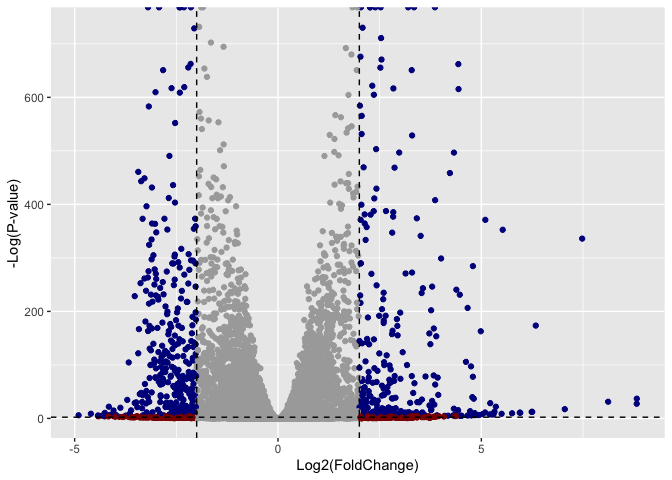
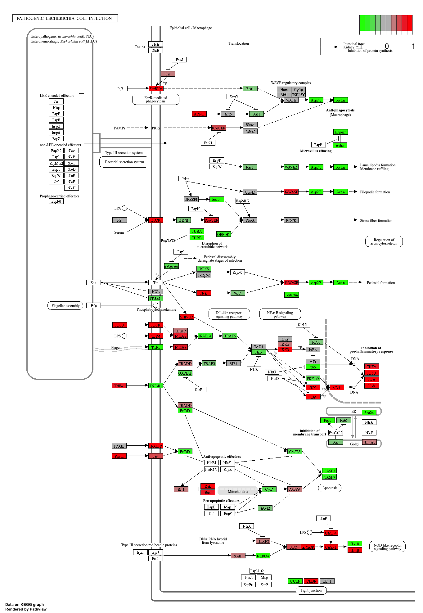
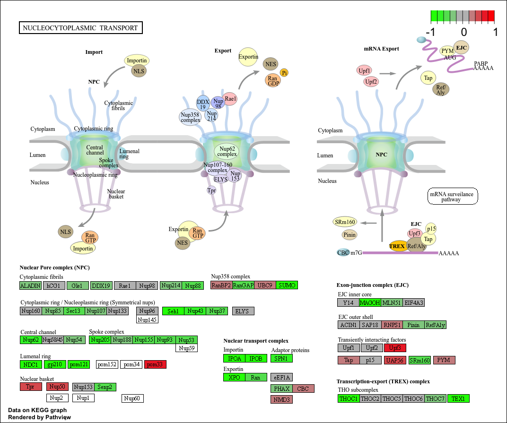

# Class_14_lab
Tessa Sterns PID: A18482353

- [Data Import](#data-import)
- [Removing Zero Count genes](#removing-zero-count-genes)
- [DESeq analysis](#deseq-analysis)
- [Data visualization](#data-visualization)
- [Add Annotation](#add-annotation)
- [Pathway Analysis with KEGG](#pathway-analysis-with-kegg)
- [Reactome](#reactome)
- [Saving our Results](#saving-our-results)

Pathway Analysis from RNA-Seq Results \## Background Working through a
complete RNASeq analysis project. The input data is coming from a KO
experiment of a HOX gene.

## Data Import

> Q. Complete the code below to remove the troublesome first column from
> countData

``` r
library(DESeq2)
```

    Loading required package: S4Vectors

    Loading required package: stats4

    Loading required package: BiocGenerics

    Loading required package: generics


    Attaching package: 'generics'

    The following objects are masked from 'package:base':

        as.difftime, as.factor, as.ordered, intersect, is.element, setdiff,
        setequal, union


    Attaching package: 'BiocGenerics'

    The following objects are masked from 'package:stats':

        IQR, mad, sd, var, xtabs

    The following objects are masked from 'package:base':

        anyDuplicated, aperm, append, as.data.frame, basename, cbind,
        colnames, dirname, do.call, duplicated, eval, evalq, Filter, Find,
        get, grep, grepl, is.unsorted, lapply, Map, mapply, match, mget,
        order, paste, pmax, pmax.int, pmin, pmin.int, Position, rank,
        rbind, Reduce, rownames, sapply, saveRDS, table, tapply, unique,
        unsplit, which.max, which.min


    Attaching package: 'S4Vectors'

    The following object is masked from 'package:utils':

        findMatches

    The following objects are masked from 'package:base':

        expand.grid, I, unname

    Loading required package: IRanges

    Loading required package: GenomicRanges

    Loading required package: GenomeInfoDb

    Loading required package: SummarizedExperiment

    Loading required package: MatrixGenerics

    Loading required package: matrixStats


    Attaching package: 'MatrixGenerics'

    The following objects are masked from 'package:matrixStats':

        colAlls, colAnyNAs, colAnys, colAvgsPerRowSet, colCollapse,
        colCounts, colCummaxs, colCummins, colCumprods, colCumsums,
        colDiffs, colIQRDiffs, colIQRs, colLogSumExps, colMadDiffs,
        colMads, colMaxs, colMeans2, colMedians, colMins, colOrderStats,
        colProds, colQuantiles, colRanges, colRanks, colSdDiffs, colSds,
        colSums2, colTabulates, colVarDiffs, colVars, colWeightedMads,
        colWeightedMeans, colWeightedMedians, colWeightedSds,
        colWeightedVars, rowAlls, rowAnyNAs, rowAnys, rowAvgsPerColSet,
        rowCollapse, rowCounts, rowCummaxs, rowCummins, rowCumprods,
        rowCumsums, rowDiffs, rowIQRDiffs, rowIQRs, rowLogSumExps,
        rowMadDiffs, rowMads, rowMaxs, rowMeans2, rowMedians, rowMins,
        rowOrderStats, rowProds, rowQuantiles, rowRanges, rowRanks,
        rowSdDiffs, rowSds, rowSums2, rowTabulates, rowVarDiffs, rowVars,
        rowWeightedMads, rowWeightedMeans, rowWeightedMedians,
        rowWeightedSds, rowWeightedVars

    Loading required package: Biobase

    Welcome to Bioconductor

        Vignettes contain introductory material; view with
        'browseVignettes()'. To cite Bioconductor, see
        'citation("Biobase")', and for packages 'citation("pkgname")'.


    Attaching package: 'Biobase'

    The following object is masked from 'package:MatrixGenerics':

        rowMedians

    The following objects are masked from 'package:matrixStats':

        anyMissing, rowMedians

``` r
countData <- read.csv("GSE37704_featurecounts.csv", row.names = 1)

metaData <- read.csv("GSE37704_metadata.csv", row.names = 1)

head(countData)
```

                    length SRR493366 SRR493367 SRR493368 SRR493369 SRR493370
    ENSG00000186092    918         0         0         0         0         0
    ENSG00000279928    718         0         0         0         0         0
    ENSG00000279457   1982        23        28        29        29        28
    ENSG00000278566    939         0         0         0         0         0
    ENSG00000273547    939         0         0         0         0         0
    ENSG00000187634   3214       124       123       205       207       212
                    SRR493371
    ENSG00000186092         0
    ENSG00000279928         0
    ENSG00000279457        46
    ENSG00000278566         0
    ENSG00000273547         0
    ENSG00000187634       258

Need the rows of metaData to match exactly to columns of countData.
countData has a lenght column that is extra.

``` r
PrettyCount <-  countData[,-1]
```

## Removing Zero Count genes

> Q. Complete the code below to filter countData to exclude genes
> (i.e. rows) where we have 0 read count across all samples
> (i.e. columns).

``` r
to.keep.inds <- rowSums(PrettyCount) > 0
nonzero_counts <- PrettyCount[to.keep.inds,]
```

## DESeq analysis

``` r
dds = DESeqDataSetFromMatrix(countData=nonzero_counts,
                             colData=metaData,
                             design=~condition)
```

    Warning in DESeqDataSet(se, design = design, ignoreRank): some variables in
    design formula are characters, converting to factors

``` r
dds = DESeq(dds)

dds
```

    class: DESeqDataSet 
    dim: 15975 6 
    metadata(1): version
    assays(4): counts mu H cooks
    rownames(15975): ENSG00000279457 ENSG00000187634 ... ENSG00000276345
      ENSG00000271254
    rowData names(22): baseMean baseVar ... deviance maxCooks
    colnames(6): SRR493366 SRR493367 ... SRR493370 SRR493371
    colData names(2): condition sizeFactor

``` r
res = results(dds, contrast=c("condition", "hoxa1_kd", "control_sirna"))
```

> Q. Call the summary() function on your results to get a sense of how
> many genes are up or down-regulated at the default 0.1 p-value cutoff.

``` r
summary(res)
```


    out of 15975 with nonzero total read count
    adjusted p-value < 0.1
    LFC > 0 (up)       : 4349, 27%
    LFC < 0 (down)     : 4396, 28%
    outliers [1]       : 0, 0%
    low counts [2]     : 1237, 7.7%
    (mean count < 0)
    [1] see 'cooksCutoff' argument of ?results
    [2] see 'independentFiltering' argument of ?results

## Data visualization

``` r
library(ggplot2)
```

    Warning: package 'ggplot2' was built under R version 4.5.2

``` r
ggplot(res) +
  aes(log2FoldChange, -log(padj)) +
  geom_point()
```

    Warning: Removed 1237 rows containing missing values or values outside the scale range
    (`geom_point()`).


> Q. Improve this plot by completing the below code, which adds color
> and axis labels

``` r
mycols <- rep("darkgrey", nrow(res))
mycols[ abs(res$log2FoldChange) > 2 ]  <- "darkred" 

inds <- (res$padj < 0.01) & (abs(res$log2FoldChange) > 2 )
mycols[ inds ] <- "darkblue"

ggplot(res) +
  aes(log2FoldChange, -log(padj)) +
  geom_point(col=mycols) +
 labs(y="-Log(P-value)", x="Log2(FoldChange)") +
 geom_vline(xintercept = c(-2, 2), colour = "black", linetype = "dashed") +
    geom_hline(yintercept = -log(0.1), colour = "black", linetype = "dashed")
```

    Warning: Removed 1237 rows containing missing values or values outside the scale range
    (`geom_point()`).



## Add Annotation

> Q. Use the mapIDs() function multiple times to add SYMBOL, ENTREZID
> and GENENAME annotation to our results by completing the code below.

``` r
library("AnnotationDbi")
library("org.Hs.eg.db")
```

``` r
columns(org.Hs.eg.db)
```

     [1] "ACCNUM"       "ALIAS"        "ENSEMBL"      "ENSEMBLPROT"  "ENSEMBLTRANS"
     [6] "ENTREZID"     "ENZYME"       "EVIDENCE"     "EVIDENCEALL"  "GENENAME"    
    [11] "GENETYPE"     "GO"           "GOALL"        "IPI"          "MAP"         
    [16] "OMIM"         "ONTOLOGY"     "ONTOLOGYALL"  "PATH"         "PFAM"        
    [21] "PMID"         "PROSITE"      "REFSEQ"       "SYMBOL"       "UCSCKG"      
    [26] "UNIPROT"     

``` r
res$symbol = mapIds(keys=row.names(res), 
                    keytype="ENSEMBL",
                    x = org.Hs.eg.db,
                    column = "SYMBOL",
                    multiVals="first")
```

    'select()' returned 1:many mapping between keys and columns

``` r
res$entrez = mapIds(org.Hs.eg.db,
                    keys=row.names(res),
                    keytype="ENSEMBL",
                    column="ENTREZID",
                    multiVals="first")
```

    'select()' returned 1:many mapping between keys and columns

``` r
res$name =   mapIds(org.Hs.eg.db,
                    keys=row.names(res),
                    keytype="ENSEMBL",
                    column="GENENAME",
                    multiVals="first")
```

    'select()' returned 1:many mapping between keys and columns

``` r
head(res, 10)
```

    log2 fold change (MLE): condition hoxa1_kd vs control_sirna 
    Wald test p-value: condition hoxa1 kd vs control sirna 
    DataFrame with 10 rows and 9 columns
                       baseMean log2FoldChange     lfcSE       stat      pvalue
                      <numeric>      <numeric> <numeric>  <numeric>   <numeric>
    ENSG00000279457   29.913579      0.1792571 0.3248215   0.551863 5.81042e-01
    ENSG00000187634  183.229650      0.4264571 0.1402658   3.040350 2.36304e-03
    ENSG00000188976 1651.188076     -0.6927205 0.0548465 -12.630156 1.43993e-36
    ENSG00000187961  209.637938      0.7297556 0.1318599   5.534326 3.12428e-08
    ENSG00000187583   47.255123      0.0405765 0.2718928   0.149237 8.81366e-01
    ENSG00000187642   11.979750      0.5428105 0.5215598   1.040744 2.97994e-01
    ENSG00000188290  108.922128      2.0570638 0.1969053  10.446970 1.51281e-25
    ENSG00000187608  350.716868      0.2573837 0.1027266   2.505522 1.22271e-02
    ENSG00000188157 9128.439422      0.3899088 0.0467164   8.346302 7.04333e-17
    ENSG00000237330    0.158192      0.7859552 4.0804729   0.192614 8.47261e-01
                           padj      symbol      entrez                   name
                      <numeric> <character> <character>            <character>
    ENSG00000279457 6.86555e-01          NA          NA                     NA
    ENSG00000187634 5.15718e-03      SAMD11      148398 sterile alpha motif ..
    ENSG00000188976 1.76553e-35       NOC2L       26155 NOC2 like nucleolar ..
    ENSG00000187961 1.13413e-07      KLHL17      339451 kelch like family me..
    ENSG00000187583 9.19031e-01     PLEKHN1       84069 pleckstrin homology ..
    ENSG00000187642 4.03379e-01       PERM1       84808 PPARGC1 and ESRR ind..
    ENSG00000188290 1.30538e-24        HES4       57801 hes family bHLH tran..
    ENSG00000187608 2.37452e-02       ISG15        9636 ISG15 ubiquitin like..
    ENSG00000188157 4.21970e-16        AGRN      375790                  agrin
    ENSG00000237330          NA      RNF223      401934 ring finger protein ..

> Q. Finally for this section let’s reorder these results by adjusted
> p-value and save them to a CSV file in your current project directory.

``` r
res = res[order(res$pvalue),]
write.csv(res, file = "deseq_results.csv")
```

## Pathway Analysis with KEGG

``` r
library(gage)
library(gageData)
library(pathview)
```

``` r
foldC <- res$log2FoldChange
names(foldC) <- res$entrez
head(foldC)
```

         1266     54855      1465      2034      2150      6659 
    -2.422719  3.201955 -2.313738 -1.888019  3.344508  2.392288 

``` r
data("kegg.sets.hs")

keggres = gage(foldC, gsets=kegg.sets.hs)

attributes(keggres)
```

    $names
    [1] "greater" "less"    "stats"  

> Q. Can you do the same procedure as above to plot the pathview figures
> for the top 5 down-reguled pathways?

``` r
head(keggres$less, 5)
```

                                                      p.geomean stat.mean
    hsa04110 Cell cycle                            8.995727e-06 -4.378644
    hsa03030 DNA replication                       9.424076e-05 -3.951803
    hsa05130 Pathogenic Escherichia coli infection 1.405864e-04 -3.765330
    hsa03013 RNA transport                         1.375901e-03 -3.028500
    hsa03440 Homologous recombination              3.066756e-03 -2.852899
                                                          p.val       q.val
    hsa04110 Cell cycle                            8.995727e-06 0.001889103
    hsa03030 DNA replication                       9.424076e-05 0.009841047
    hsa05130 Pathogenic Escherichia coli infection 1.405864e-04 0.009841047
    hsa03013 RNA transport                         1.375901e-03 0.072234819
    hsa03440 Homologous recombination              3.066756e-03 0.128803765
                                                   set.size         exp1
    hsa04110 Cell cycle                                 121 8.995727e-06
    hsa03030 DNA replication                             36 9.424076e-05
    hsa05130 Pathogenic Escherichia coli infection       53 1.405864e-04
    hsa03013 RNA transport                              144 1.375901e-03
    hsa03440 Homologous recombination                    28 3.066756e-03

``` r
pathview(pathway.id = "hsa04110", gene.data = foldC)
```

    'select()' returned 1:1 mapping between keys and columns

    Info: Working in directory /Users/tsterns/Desktop/BIMM143_github/Class_14

    Info: Writing image file hsa04110.pathview.png


``` r
pathview(pathway.id = "hsa03030", gene.data = foldC)
```

    'select()' returned 1:1 mapping between keys and columns

    Info: Working in directory /Users/tsterns/Desktop/BIMM143_github/Class_14

    Info: Writing image file hsa03030.pathview.png


``` r
pathview(pathway.id = "hsa05130", gene.data = foldC)
```

    'select()' returned 1:1 mapping between keys and columns

    Info: Working in directory /Users/tsterns/Desktop/BIMM143_github/Class_14

    Info: Writing image file hsa05130.pathview.png



``` r
pathview(pathway.id = "hsa03013", gene.data = foldC)
```

    'select()' returned 1:1 mapping between keys and columns

    Info: Working in directory /Users/tsterns/Desktop/BIMM143_github/Class_14

    Info: Writing image file hsa03013.pathview.png



``` r
pathview(pathway.id = "hsa03440", gene.data = foldC)
```

    'select()' returned 1:1 mapping between keys and columns

    Info: Working in directory /Users/tsterns/Desktop/BIMM143_github/Class_14

    Info: Writing image file hsa03440.pathview.png

 \## Pathway analysis with GO

Same analysis but using GO genesets

``` r
data(go.sets.hs)
data(go.subs.hs)

# Focus on Biological Process subset of GO
gobpsets = go.sets.hs[go.subs.hs$BP]

gobpres = gage(foldC, gsets=gobpsets, same.dir=TRUE)

lapply(gobpres, head)
```

    $greater
                                                 p.geomean stat.mean        p.val
    GO:0007156 homophilic cell adhesion       8.519724e-05  3.824205 8.519724e-05
    GO:0002009 morphogenesis of an epithelium 1.396681e-04  3.653886 1.396681e-04
    GO:0048729 tissue morphogenesis           1.432451e-04  3.643242 1.432451e-04
    GO:0007610 behavior                       1.925222e-04  3.565432 1.925222e-04
    GO:0060562 epithelial tube morphogenesis  5.932837e-04  3.261376 5.932837e-04
    GO:0035295 tube development               5.953254e-04  3.253665 5.953254e-04
                                                  q.val set.size         exp1
    GO:0007156 homophilic cell adhesion       0.1951953      113 8.519724e-05
    GO:0002009 morphogenesis of an epithelium 0.1951953      339 1.396681e-04
    GO:0048729 tissue morphogenesis           0.1951953      424 1.432451e-04
    GO:0007610 behavior                       0.1967577      426 1.925222e-04
    GO:0060562 epithelial tube morphogenesis  0.3565320      257 5.932837e-04
    GO:0035295 tube development               0.3565320      391 5.953254e-04

    $less
                                                p.geomean stat.mean        p.val
    GO:0048285 organelle fission             1.536227e-15 -8.063910 1.536227e-15
    GO:0000280 nuclear division              4.286961e-15 -7.939217 4.286961e-15
    GO:0007067 mitosis                       4.286961e-15 -7.939217 4.286961e-15
    GO:0000087 M phase of mitotic cell cycle 1.169934e-14 -7.797496 1.169934e-14
    GO:0007059 chromosome segregation        2.028624e-11 -6.878340 2.028624e-11
    GO:0000236 mitotic prometaphase          1.729553e-10 -6.695966 1.729553e-10
                                                    q.val set.size         exp1
    GO:0048285 organelle fission             5.841698e-12      376 1.536227e-15
    GO:0000280 nuclear division              5.841698e-12      352 4.286961e-15
    GO:0007067 mitosis                       5.841698e-12      352 4.286961e-15
    GO:0000087 M phase of mitotic cell cycle 1.195672e-11      362 1.169934e-14
    GO:0007059 chromosome segregation        1.658603e-08      142 2.028624e-11
    GO:0000236 mitotic prometaphase          1.178402e-07       84 1.729553e-10

    $stats
                                              stat.mean     exp1
    GO:0007156 homophilic cell adhesion        3.824205 3.824205
    GO:0002009 morphogenesis of an epithelium  3.653886 3.653886
    GO:0048729 tissue morphogenesis            3.643242 3.643242
    GO:0007610 behavior                        3.565432 3.565432
    GO:0060562 epithelial tube morphogenesis   3.261376 3.261376
    GO:0035295 tube development                3.253665 3.253665

> Q: What pathway has the most significant “Entities p-value”? Do the
> most significant pathways listed match your previous KEGG results?
> What factors could cause differences between the two methods?

Homophilic cell adhesion has the largest p-value using the GO database
whereas in KEGG it was cell cycle. The main reason why there is a
difference is because the two databases are using different reference
data.

## Reactome

Available as a web interface <https://reactome.org/>, but also can be
loading into R.

The website wants a text file with one gene symbol per line.

``` r
sig_genes <- res[res$padj <= 0.05 & !is.na(res$padj), "symbol"]
head(sig_genes)
```

    ENSG00000117519 ENSG00000183508 ENSG00000159176 ENSG00000116016 ENSG00000164251 
             "CNN3"        "TENT5C"         "CSRP1"         "EPAS1"         "F2RL1" 
    ENSG00000124766 
             "SOX4" 

``` r
write.table(sig_genes, file="significant_genes.txt", row.names=FALSE, col.names=FALSE, quote=FALSE)
```

## Saving our Results

``` r
write.csv(res, file = "myresults.csv")
```
