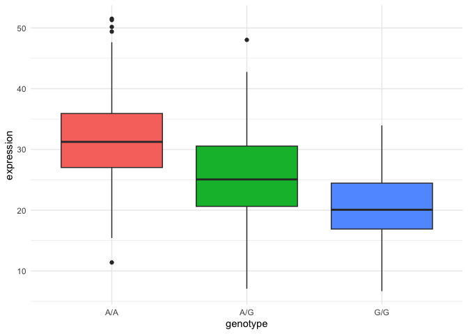

# Class_17_Hw
Tessa Sterns PID:A18482353

``` r
my_data <- read.table("asthma_results.txt")

library(ggplot2)
```

    Warning: package 'ggplot2' was built under R version 4.5.2

``` r
summary(my_data)
```

        sample              geno                exp        
     Length:462         Length:462         Min.   : 6.675  
     Class :character   Class :character   1st Qu.:20.004  
     Mode  :character   Mode  :character   Median :25.116  
                                           Mean   :25.640  
                                           3rd Qu.:30.779  
                                           Max.   :51.518  

``` r
library(dplyr)
```


    Attaching package: 'dplyr'

    The following objects are masked from 'package:stats':

        filter, lag

    The following objects are masked from 'package:base':

        intersect, setdiff, setequal, union

``` r
AA <- my_data %>% filter(geno == "A/A")

AG <- my_data %>% filter(geno == "A/G")

GG <- my_data %>% filter(geno == "G/G")
```

> Q13: Read this file into R and determine the sample size for each
> genotype and their corresponding median expression levels for each of
> these genotypes.

The A/A genotype has 108 samples with a median expression of 31.248475.
The A/G genotype has 233 samples with a median expression of
25.06486.The G/G genotype has 121 samples with a median expression of
20.07363.

> Q14: Generate a boxplot with a box per genotype, what could you infer
> from the relative expression value between A/A and G/G displayed in
> this plot? Does the SNP effect the expression of ORMDL3?

``` r
my_plot <- ggplot(my_data) + 
  aes(x = geno, y = exp,
      fill = geno) +
  geom_boxplot() +
  labs(x = "genotype", y = "expression") +
  theme_minimal() +
  theme(legend.position = "FALSE")
my_plot
```



The SNP does effect expression levels with A/A showing the highest
expression. Between AA and GG there is about a 12 point decrease in
expression. These results indicate that the SNP allele of ORMDL3 can
cause a change in expression levels of the protein product wich can lead
to and increased risk of childhood asthma.
