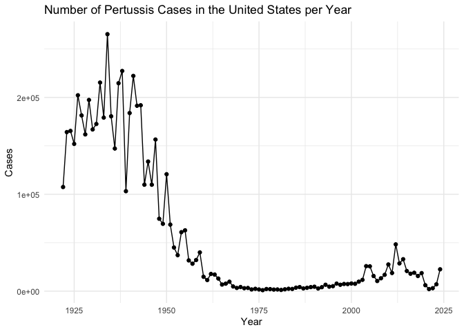
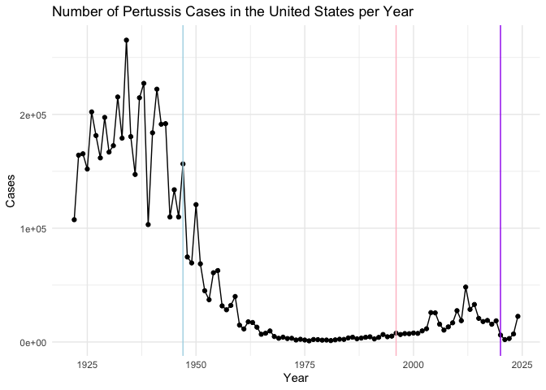
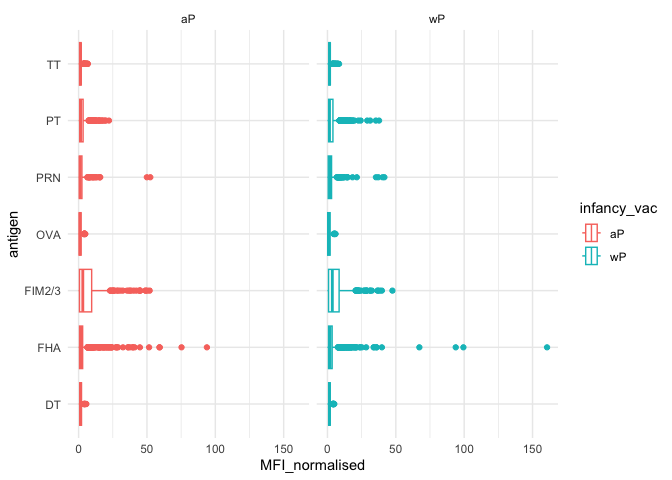
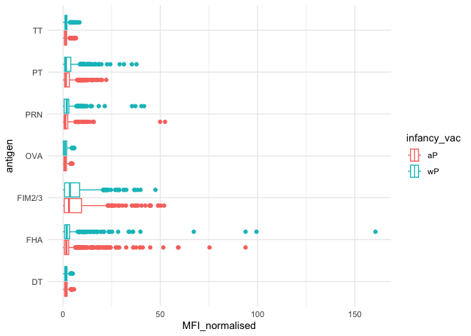
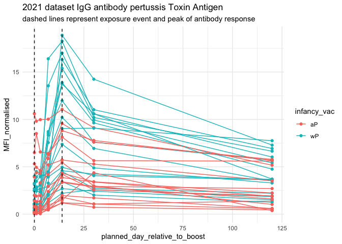

# Class_19_lab
Tessa Sterns PID A18482353

## Pertussis is a backterial lung infection originally treated with a wP attenuated vaccine. This lab will start with importing case number data from the cdc.

``` r
cdc <- data.frame(
                          Year = c(1922L,
                                   1923L,1924L,1925L,1926L,1927L,1928L,
                                   1929L,1930L,1931L,1932L,1933L,1934L,1935L,
                                   1936L,1937L,1938L,1939L,1940L,1941L,
                                   1942L,1943L,1944L,1945L,1946L,1947L,1948L,
                                   1949L,1950L,1951L,1952L,1953L,1954L,
                                   1955L,1956L,1957L,1958L,1959L,1960L,
                                   1961L,1962L,1963L,1964L,1965L,1966L,1967L,
                                   1968L,1969L,1970L,1971L,1972L,1973L,
                                   1974L,1975L,1976L,1977L,1978L,1979L,1980L,
                                   1981L,1982L,1983L,1984L,1985L,1986L,
                                   1987L,1988L,1989L,1990L,1991L,1992L,1993L,
                                   1994L,1995L,1996L,1997L,1998L,1999L,
                                   2000L,2001L,2002L,2003L,2004L,2005L,
                                   2006L,2007L,2008L,2009L,2010L,2011L,2012L,
                                   2013L,2014L,2015L,2016L,2017L,2018L,
                                   2019L,2020L,2021L,2022L,2023L,2024L),
  Cases = c(107473,
                                   164191,165418,152003,202210,181411,
                                   161799,197371,166914,172559,215343,179135,
                                   265269,180518,147237,214652,227319,103188,
                                   183866,222202,191383,191890,109873,
                                   133792,109860,156517,74715,69479,120718,
                                   68687,45030,37129,60886,62786,31732,28295,
                                   32148,40005,14809,11468,17749,17135,
                                   13005,6799,7717,9718,4810,3285,4249,
                                   3036,3287,1759,2402,1738,1010,2177,2063,
                                   1623,1730,1248,1895,2463,2276,3589,
                                   4195,2823,3450,4157,4570,2719,4083,6586,
                                   4617,5137,7796,6564,7405,7298,7867,
                                   7580,9771,11647,25827,25616,15632,10454,
                                   13278,16858,27550,18719,48277,28639,
                                   32971,20762,17972,18975,15609,18617,6124,
                                   2116,3044,7063,22538)
)

library(ggplot2)
```

    Warning: package 'ggplot2' was built under R version 4.5.2

``` r
ggplot(cdc) +
  aes(Year, Cases) +
  geom_point() +
  geom_line() + 
  labs(title = "Number of Pertussis Cases in the United States per Year") +
  theme_minimal()
```



Adding major milestones

``` r
ggplot(cdc) +
  aes(Year, Cases) +
  geom_point() +
  geom_line() + 
  labs(title = "Number of Pertussis Cases in the United States per Year") +
  theme_minimal() +
  geom_vline(xintercept = 1947, col = "lightblue") +
  geom_vline(xintercept = 1996, col = "pink") +
  geom_vline(xintercept = 2020, col = "purple")
```



The full introduction of the wP (whole cell attenuated) vaccine caused a
dramatic decrease in pertussis cases starting in 1947. 10 years after
the introduction of the aP (acellular vaccine) there has been an
increase in the number of cases annually. This could be due to anti-vax
movements causing distrust in public health and a lower vaccination rate
in the population. It could also just be that the a-cellular vaccine is
lacking in certain components that generated a strong immune response in
the wP vaccine. The slow rise could be because individuals with the
older vaccine were still protected. Something about the new aP vaccine
does not confer lasting immunity, thus needing boosters and why we see a
10 year pause before cases increase. During social distancing due to
covid-19 pandemic in 2020 cases dropped but in recent years the number
of cases has been rising to pre-pandemic levels.

## CMI-PB project

The mission of CMI-PB is to provide the scientific community with a
comprehensive, high-quality and freely accessible resource of Pertussis
booster vaccination.

``` r
library(jsonlite)

subject <- read_json("https://www.cmi-pb.org/api/subject", simplifyVector = TRUE) 

library(dplyr)
```


    Attaching package: 'dplyr'

    The following objects are masked from 'package:stats':

        filter, lag

    The following objects are masked from 'package:base':

        intersect, setdiff, setequal, union

> Q. How many wP and aP subjects are there?

``` r
table(subject$infancy_vac)
```


    aP wP 
    87 85 

> Q. What is the breakdown by “biological_sex” and “race”?

``` r
table(subject$biological_sex)
```


    Female   Male 
       112     60 

``` r
table(subject$race)
```


                American Indian/Alaska Native 
                                            1 
                                        Asian 
                                           44 
                    Black or African American 
                                            5 
                           More Than One Race 
                                           19 
    Native Hawaiian or Other Pacific Islander 
                                            2 
                      Unknown or Not Reported 
                                           21 
                                        White 
                                           80 

``` r
table(subject$race, subject$biological_sex)
```

                                               
                                                Female Male
      American Indian/Alaska Native                  0    1
      Asian                                         32   12
      Black or African American                      2    3
      More Than One Race                            15    4
      Native Hawaiian or Other Pacific Islander      1    1
      Unknown or Not Reported                       14    7
      White                                         48   32

This breakdown of demographics in not a great representation of the US
population as a whole, but its what we have to work with.

``` r
specimen <- read_json("http://cmi-pb.org/api/v5_1/specimen", simplifyVector = T)

ab_titer <- read_json("https://www.cmi-pb.org/api/v5_1/plasma_ab_titer", simplifyVector = T)
```

Now that we have the data imported we can combine our datasets to
analyze the whole data.

``` r
meta <- inner_join(subject, specimen)
```

    Joining with `by = join_by(subject_id)`

``` r
abData <- inner_join(ab_titer, meta)
```

    Joining with `by = join_by(specimen_id)`

> Q. How many Ab measurments do we have?

``` r
nrow(abData)
```

    [1] 61956

> Q How many specimens (i.e. entries in abdata) do we have for each
> isotype?

``` r
table(abData$isotype)
```


      IgE   IgG  IgG1  IgG2  IgG3  IgG4 
     6698  7265 11993 12000 12000 12000 

> Q. how many different antigens?

16

``` r
unique(abData$antigen)
```

     [1] "Total"   "PT"      "PRN"     "FHA"     "ACT"     "LOS"     "FELD1"  
     [8] "BETV1"   "LOLP1"   "Measles" "PTM"     "FIM2/3"  "TT"      "DT"     
    [15] "OVA"     "PD1"    

> Q. What are the different \$dataset values in abdata and what do you
> notice about the number of rows for the most “recent” dataset?

``` r
table(abData$dataset)
```


    2020_dataset 2021_dataset 2022_dataset 2023_dataset 
           31520         8085         7301        15050 

The most current dataset has about half as many data points as the
initial 2020 dataset but double that or the 2021 or 2022 datasets.

## Examining IgG Ab titer levels

IgG is the most crucial antibody for lasting immunity.

``` r
IgG <- abData |> filter(isotype == "IgG")

ggplot(IgG) +
  aes(MFI_normalised, antigen) +
  geom_boxplot()
```


Faceting the data by wP vs aP

``` r
ggplot(IgG) +
  aes(MFI_normalised, antigen, col= infancy_vac) +
  geom_boxplot() +
  facet_wrap(~infancy_vac) +
  theme_minimal()
```



or

``` r
ggplot(IgG) +
  aes(MFI_normalised, antigen, col= infancy_vac) +
  geom_boxplot() +
  theme_minimal()
```



focusing on the main pT toxin

``` r
pT <- IgG |> filter(antigen == "PT")

pT.21 <- pT |> filter(dataset == "2021_dataset")

ggplot(pT.21) +
  aes(planned_day_relative_to_boost, MFI_normalised,
      col = infancy_vac, group = subject_id) +
  geom_line() +
  geom_point() +
  theme_minimal() +
  geom_vline(xintercept = 0, linetype = "dashed") +
  geom_vline(xintercept = 14, linetype = "dashed") +
  labs(title = "2021 dataset IgG antibody pertussis Toxin Antigen", subtitle = "dashed lines represent exposure event and peak of antibody response")
```



This graph shows the time course of antibody response to pertussis toxin
comparing the wP vaccine (teal) to the aP vaccine(red). The levels peak
around day 14 and decilne and in general the whole bacteria vaccine (wP)
has a higher levels of antibody response.
