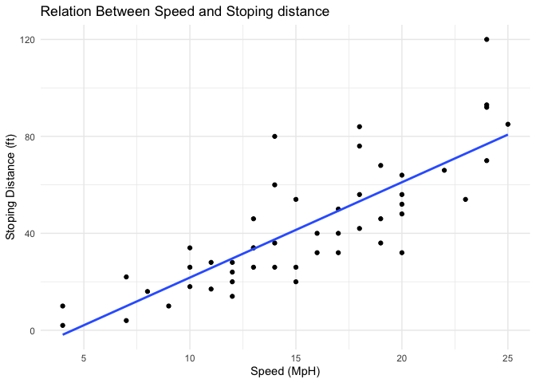
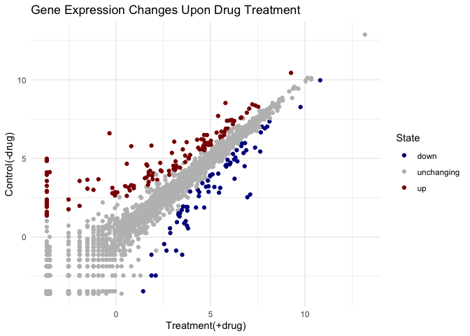
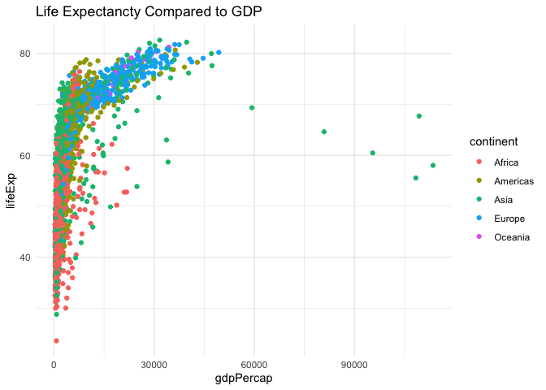
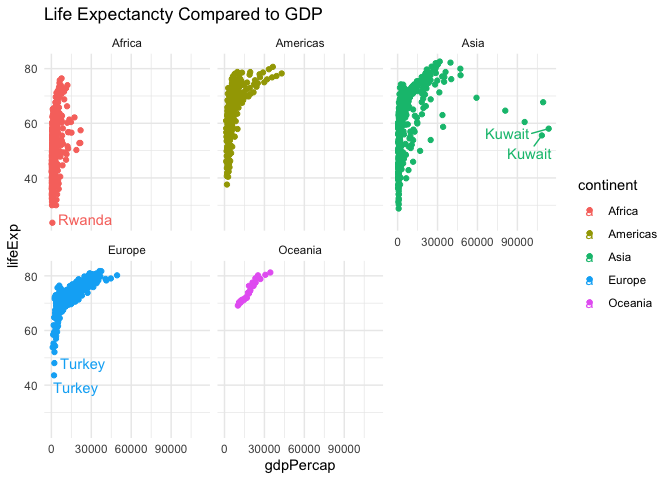

# Class 05: Data Visualization with GGPLOT
Tessa Sterns PID: A18482353

This week on Bioinformatics! We are using **ggplot** package to make
pretty pretty pictures with data. Woo! However this is not the only data
visualization tool in R such as; “base” R, or ggplot2.

“Base” R plot:

``` r
head(cars)
```

      speed dist
    1     4    2
    2     4   10
    3     7    4
    4     7   22
    5     8   16
    6     9   10

Using the `plot()` function.

``` r
plot(cars)
```


> Key-point: base R is quick but dirty. Behold the majesty that is
> **ggplot**

The package needs to be installed first with `install.packages()`
function. **only in console not in lab reports.** One time only.
Secondly, the package needs to be loaded using the `linrary()` function.
This is needed every time.

``` r
library(ggplot2)
```

    Warning: package 'ggplot2' was built under R version 4.5.2

``` r
ggplot(cars)
```


T-T Every ggplot needs at least 3 layers, Data, aes(), and geom()

``` r
ggplot(cars) +
 aes(x = speed, y = dist) +
  geom_point() 
```


``` r
hist(cars$speed)
```


> Key takeawa. For simple plots, base R is quicker more concise code.
> Good for initial exploratory data analysis. However, ggplot is easier
> to customize.

The more layers, the more custome the graph.

``` r
ggplot(cars) +
 aes(x = speed, y = dist) +
  geom_point() +
  geom_smooth(method = lm, se = FALSE) + 
  ## se = false removes error bar
  labs(title = "Relation Between Speed and Stoping distance", x = "Speed (MpH)", y = "Stoping Distance (ft)") +
  theme_minimal()
```

    `geom_smooth()` using formula = 'y ~ x'



``` r
## labs(title =, x= ,y=) for changing lables.
```

Reading gene expresion data from a url

``` r
url <- "https://bioboot.github.io/bimm143_S20/class-material/up_down_expression.txt"
genes <- read.delim(url)
head(genes)
```

            Gene Condition1 Condition2      State
    1      A4GNT -3.6808610 -3.4401355 unchanging
    2       AAAS  4.5479580  4.3864126 unchanging
    3      AASDH  3.7190695  3.4787276 unchanging
    4       AATF  5.0784720  5.0151916 unchanging
    5       AATK  0.4711421  0.5598642 unchanging
    6 AB015752.4 -3.6808610 -3.5921390 unchanging

``` r
nrow(genes)
```

    [1] 5196

``` r
ncol(genes)
```

    [1] 4

``` r
sum(genes$State == "up")
```

    [1] 127

``` r
## another useful function for counting occurrences in a data set is the `table()` function.
table(genes$State)
```


          down unchanging         up 
            72       4997        127 

> Q1 how many genes are in this wee dataset? 5,196 Q2 How many
> upregulated genes are in this data set? 127

``` r
ggplot(genes) + 
  aes(x = Condition1, 
      y = Condition2,
      colour = State) +
  geom_point() +
  theme_minimal() +
  scale_color_manual(values = c("darkblue", "gray", "darkred")) +
  labs(title = "Gene Expression Changes Upon Drug Treatment", 
       y = "Control(-drug)",
       x = "Treatment(+drug)")
```



\## Even more plotting

``` r
url2 <- "https://raw.githubusercontent.com/jennybc/gapminder/master/inst/extdata/gapminder.tsv"

gapminder <- read.delim(url2)
head(gapminder, 3)
```

          country continent year lifeExp      pop gdpPercap
    1 Afghanistan      Asia 1952  28.801  8425333  779.4453
    2 Afghanistan      Asia 1957  30.332  9240934  820.8530
    3 Afghanistan      Asia 1962  31.997 10267083  853.1007

``` r
tail(gapminder, 3)
```

          country continent year lifeExp      pop gdpPercap
    1702 Zimbabwe    Africa 1997  46.809 11404948  792.4500
    1703 Zimbabwe    Africa 2002  39.989 11926563  672.0386
    1704 Zimbabwe    Africa 2007  43.487 12311143  469.7093

``` r
tab <- table(gapminder$country)
length(tab)
```

    [1] 142

``` r
length(table(gapminder$continent))
```

    [1] 5

``` r
## unique() will list unique entries
```

> How many countries are in this dataset? 142 How many continents? 5

``` r
ggplot(gapminder) +
  aes(x = gdpPercap,
      y = lifeExp, 
      col = continent) +
  geom_point() + 
  theme_minimal() +
  labs(title = "Life Expectancty Compared to GDP")
```



``` r
library(ggrepel)
ggplot(gapminder) +
  aes(x = gdpPercap,
      y = lifeExp, 
      col = continent,
      label = country) +
  geom_point() + 
  theme_minimal() +
  geom_text_repel() +
  labs(title = "Life Expectancty Compared to GDP") +
  facet_wrap(~continent)
```

    Warning: ggrepel: 623 unlabeled data points (too many overlaps). Consider
    increasing max.overlaps

    Warning: ggrepel: 358 unlabeled data points (too many overlaps). Consider
    increasing max.overlaps

    Warning: ggrepel: 300 unlabeled data points (too many overlaps). Consider
    increasing max.overlaps

    Warning: ggrepel: 24 unlabeled data points (too many overlaps). Consider
    increasing max.overlaps

    Warning: ggrepel: 394 unlabeled data points (too many overlaps). Consider
    increasing max.overlaps



Using the **ggreple** can make sensible lables. \## Summary Compared to
base R ggplot is capable of making publication ready pretty graphics.
The code builds upon layers so it is highly customizable. The layering
of the code also allows it to be easily read by other coders.
