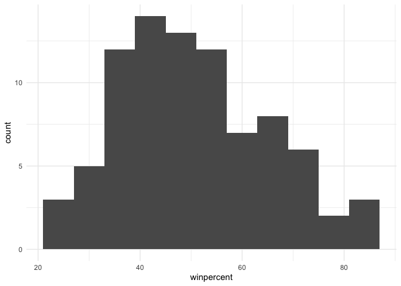
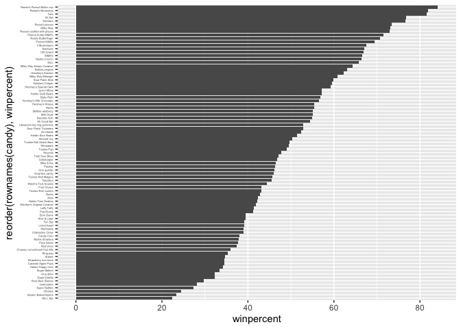
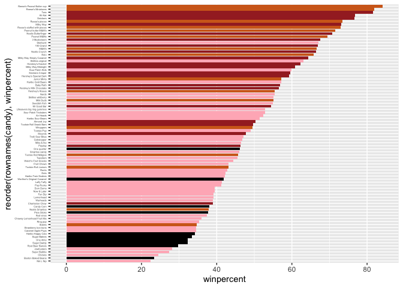
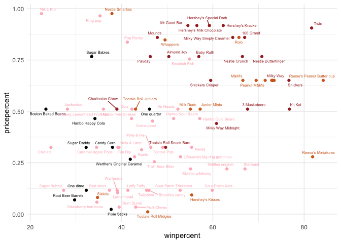
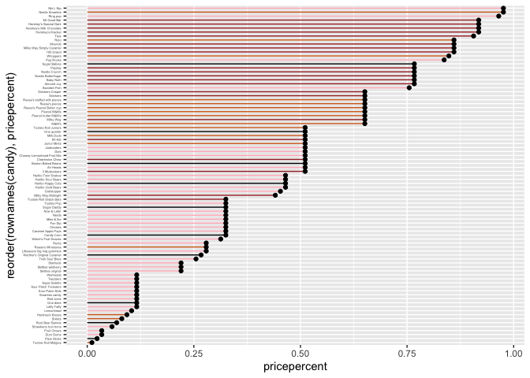
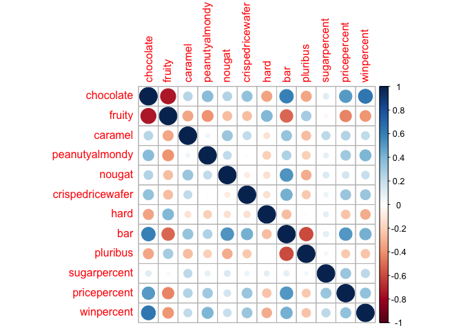

# class_10_lab
Tessa Sterns PID: A18482353

- [Importing candy data](#importing-candy-data)
- [Overall Candy Rankings](#overall-candy-rankings)
- [Overall Candy Rankings](#overall-candy-rankings-1)
- [Taking a look at pricepercent](#taking-a-look-at-pricepercent)
- [Exploring the correlation
  structure](#exploring-the-correlation-structure)
- [Principal Component Analysis](#principal-component-analysis)

## Importing candy data

``` r
candy <- read.csv("candy-data.csv", row.names = 1)

head(candy)
```

                 chocolate fruity caramel peanutyalmondy nougat crispedricewafer
    100 Grand            1      0       1              0      0                1
    3 Musketeers         1      0       0              0      1                0
    One dime             0      0       0              0      0                0
    One quarter          0      0       0              0      0                0
    Air Heads            0      1       0              0      0                0
    Almond Joy           1      0       0              1      0                0
                 hard bar pluribus sugarpercent pricepercent winpercent
    100 Grand       0   1        0        0.732        0.860   66.97173
    3 Musketeers    0   1        0        0.604        0.511   67.60294
    One dime        0   0        0        0.011        0.116   32.26109
    One quarter     0   0        0        0.011        0.511   46.11650
    Air Heads       0   0        0        0.906        0.511   52.34146
    Almond Joy      0   1        0        0.465        0.767   50.34755

``` r
flextable::flextable(head(candy))
```


> Q1. How many different candy types are in this dataset?

There are 85 types of candy in this dataset.

> Q2. How many fruity candy types are in the dataset?

There are 38 types of fruity candy in this dataset.

## Overall Candy Rankings

> Q3. What is your favorite candy in the dataset and what is it’s
> winpercent value?

My favorite candy in this dataset is Milkyway Midnight with a win
percent of 60.800701.

> Q4. What is the winpercent value for “Kit Kat”?

Kit Kat has a winpercent of 76.7686.

> Q5. What is the winpercent value for “Tootsie Roll Snack Bars”?

Tootsie Roll Snack Bars has a win percent of 49.653503.

``` r
skimr::skim(candy)
```

|                                                  |       |
|:-------------------------------------------------|:------|
| Name                                             | candy |
| Number of rows                                   | 85    |
| Number of columns                                | 12    |
| \_\_\_\_\_\_\_\_\_\_\_\_\_\_\_\_\_\_\_\_\_\_\_   |       |
| Column type frequency:                           |       |
| numeric                                          | 12    |
| \_\_\_\_\_\_\_\_\_\_\_\_\_\_\_\_\_\_\_\_\_\_\_\_ |       |
| Group variables                                  | None  |

Data summary

**Variable type: numeric**

| skim_variable | n_missing | complete_rate | mean | sd | p0 | p25 | p50 | p75 | p100 | hist |
|:---|---:|---:|---:|---:|---:|---:|---:|---:|---:|:---|
| chocolate | 0 | 1 | 0.44 | 0.50 | 0.00 | 0.00 | 0.00 | 1.00 | 1.00 | ▇▁▁▁▆ |
| fruity | 0 | 1 | 0.45 | 0.50 | 0.00 | 0.00 | 0.00 | 1.00 | 1.00 | ▇▁▁▁▆ |
| caramel | 0 | 1 | 0.16 | 0.37 | 0.00 | 0.00 | 0.00 | 0.00 | 1.00 | ▇▁▁▁▂ |
| peanutyalmondy | 0 | 1 | 0.16 | 0.37 | 0.00 | 0.00 | 0.00 | 0.00 | 1.00 | ▇▁▁▁▂ |
| nougat | 0 | 1 | 0.08 | 0.28 | 0.00 | 0.00 | 0.00 | 0.00 | 1.00 | ▇▁▁▁▁ |
| crispedricewafer | 0 | 1 | 0.08 | 0.28 | 0.00 | 0.00 | 0.00 | 0.00 | 1.00 | ▇▁▁▁▁ |
| hard | 0 | 1 | 0.18 | 0.38 | 0.00 | 0.00 | 0.00 | 0.00 | 1.00 | ▇▁▁▁▂ |
| bar | 0 | 1 | 0.25 | 0.43 | 0.00 | 0.00 | 0.00 | 0.00 | 1.00 | ▇▁▁▁▂ |
| pluribus | 0 | 1 | 0.52 | 0.50 | 0.00 | 0.00 | 1.00 | 1.00 | 1.00 | ▇▁▁▁▇ |
| sugarpercent | 0 | 1 | 0.48 | 0.28 | 0.01 | 0.22 | 0.47 | 0.73 | 0.99 | ▇▇▇▇▆ |
| pricepercent | 0 | 1 | 0.47 | 0.29 | 0.01 | 0.26 | 0.47 | 0.65 | 0.98 | ▇▇▇▇▆ |
| winpercent | 0 | 1 | 50.32 | 14.71 | 22.45 | 39.14 | 47.83 | 59.86 | 84.18 | ▃▇▆▅▂ |

> Q6. Is there any variable/column that looks to be on a different scale
> to the majority of the other columns in the dataset?

Yes the win percent column is in a whole number percent(ie 65.4%)
whereas the other columns like percent sugar are in a decimal point
percent (ie 0.923).

> Q7. What do you think a zero and one represent for the
> candy\$chocolate column?

They are the binary representation of T/F 1 would be true/ has
chocolate, and 0 would be false/no chocolate.

> Q8. Plot a histogram of winpercent values

``` r
library(ggplot2)
```

    Warning: package 'ggplot2' was built under R version 4.5.2

``` r
ggplot(candy) +
aes(x = winpercent) +
  geom_histogram(binwidth = 6) +
  theme_minimal()
```



> Q9. Is the distribution of winpercent values symmetrical?

No it it slightly right skewed with the normal distribution being
centered closer to 40%.

> Q10. Is the center of the distribution above or below 50%?

Below 50% it is around 40%. 22.445341, 39.141056, 47.829754, 50.3167638,
59.863998, 84.18029

> Q11. On average is chocolate candy higher or lower ranked than fruit
> candy?

``` r
library(tidyverse)
```

    Warning: package 'readr' was built under R version 4.5.2

    ── Attaching core tidyverse packages ──────────────────────── tidyverse 2.0.0 ──
    ✔ dplyr     1.1.4     ✔ readr     2.1.6
    ✔ forcats   1.0.1     ✔ stringr   1.6.0
    ✔ lubridate 1.9.4     ✔ tibble    3.3.0
    ✔ purrr     1.2.0     ✔ tidyr     1.3.1
    ── Conflicts ────────────────────────────────────────── tidyverse_conflicts() ──
    ✖ dplyr::filter() masks stats::filter()
    ✖ dplyr::lag()    masks stats::lag()
    ℹ Use the conflicted package (<http://conflicted.r-lib.org/>) to force all conflicts to become errors

``` r
j.choc <- candy %>% 
  filter(chocolate == 1) 
mean(j.choc$winpercent)
```

    [1] 60.92153

``` r
j.fruit <- candy %>%
  filter(fruity == 1)
mean(j.fruit$winpercent)
```

    [1] 44.11974

Chocolate has a higher average win percent 60.9215294 than fruity candy
44.1197414.

> Q12. Is this difference statistically significant?

``` r
t.test(x = j.choc$winpercent, 
  y = j.fruit$winpercent)
```


        Welch Two Sample t-test

    data:  j.choc$winpercent and j.fruit$winpercent
    t = 6.2582, df = 68.882, p-value = 2.871e-08
    alternative hypothesis: true difference in means is not equal to 0
    95 percent confidence interval:
     11.44563 22.15795
    sample estimates:
    mean of x mean of y 
     60.92153  44.11974 

With a p-value of 2.871e-08 we accept the null hypothesis of the
two-sample ttest. This indicates that there is a statistical difference
between chocolate and fruity candy with chocolate being more popular.

## Overall Candy Rankings

> Q13. What are the five least liked candy types in this set?

The five least liked candies are; Nik L Nip, Boston Baked Beans,
Chiclets, Super Bubble, Jawbusters.

> Q14. What are the top 5 all time favorite candy types out of this set?

The top five most liked candies are; Snickers, Kit Kat, Twix, Reese’s
Miniatures, Reese’s Peanut Butter cup.

> Q15. Make a first barplot of candy ranking based on winpercent values.

``` r
ggplot(candy) + 
  aes(x= winpercent, rownames(candy)) +
  geom_col()
```


> Q16. This is quite ugly, use the reorder() function to get the bars
> sorted by winpercent?

``` r
ggplot(candy) + 
  aes(x= winpercent, y= reorder(rownames(candy), winpercent)) +
  geom_col() +
  theme(axis.text.y = element_text(size = 3))
```



``` r
my_cols=rep("black", nrow(candy))
my_cols[as.logical(candy$chocolate)] = "chocolate"
my_cols[as.logical(candy$bar)] = "brown"
my_cols[as.logical(candy$fruity)] = "lightpink"

ggplot(candy) + 
  aes(winpercent, reorder(rownames(candy),winpercent)) +
  geom_col(fill=my_cols) + 
   theme(axis.text.y = element_text(size = 3))
```



> Q17. What is the worst ranked chocolate candy?

Sixlets

> Q18. What is the best ranked fruity candy?

Starburst

## Taking a look at pricepercent

``` r
library(ggrepel)

ggplot(candy) +
  aes(winpercent, pricepercent, label=rownames(candy)) +
  geom_point(col=my_cols) + 
  geom_text_repel(col=my_cols, size=2, max.overlaps = 10) +
  theme_minimal()
```

    Warning: ggrepel: 4 unlabeled data points (too many overlaps). Consider
    increasing max.overlaps



> Q19. Which candy type is the highest ranked in terms of winpercent for
> the least money - i.e. offers the most bang for your buck?

Reese’s miniatures

> Q20. What are the top 5 most expensive candy types in the dataset and
> of these which is the least popular?

``` r
ord <- order(candy$pricepercent, decreasing = TRUE)
head( candy[ord,c(11,12)], n=5 )
```

                             pricepercent winpercent
    Nik L Nip                       0.976   22.44534
    Nestle Smarties                 0.976   37.88719
    Ring pop                        0.965   35.29076
    Hershey's Krackel               0.918   62.28448
    Hershey's Milk Chocolate        0.918   56.49050

The most expensive candies are Nik L Nip, Nestle Smarties, Ring pop,
Hershey’s Krackel, Hershey’s Milk Chocolate and the least liked is Nik L
Nip.

> Q21. Make a barplot again with geom_col() this time using pricepercent
> and then improve this step by step, first ordering the x-axis by value
> and finally making a so called “dot chat” or “lollipop” chart by
> swapping geom_col() for geom_point() + geom_segment().

``` r
ggplot(candy) +
  aes(pricepercent, reorder(rownames(candy),     pricepercent)) +
  geom_segment(aes(yend = reorder(rownames(candy), pricepercent), 
  xend = 0), col=my_cols) +
    geom_point() +
  theme(axis.text.y = element_text(size = 3))
```



## Exploring the correlation structure

``` r
library(corrplot)
```

    corrplot 0.95 loaded

``` r
cij <- cor(candy)
corrplot(cij)
```



> Q22. Examining this plot what two variables are anti-correlated
> (i.e. have minus values)?

Chocolate and fruity

> Q23. Similarly, what two variables are most positively correlated?

chocolate and bar or chocolate and win percentage

## Principal Component Analysis

``` r
pca <- prcomp(candy, scale = T)
summary(pca)
```

    Importance of components:
                              PC1    PC2    PC3     PC4    PC5     PC6     PC7
    Standard deviation     2.0788 1.1378 1.1092 1.07533 0.9518 0.81923 0.81530
    Proportion of Variance 0.3601 0.1079 0.1025 0.09636 0.0755 0.05593 0.05539
    Cumulative Proportion  0.3601 0.4680 0.5705 0.66688 0.7424 0.79830 0.85369
                               PC8     PC9    PC10    PC11    PC12
    Standard deviation     0.74530 0.67824 0.62349 0.43974 0.39760
    Proportion of Variance 0.04629 0.03833 0.03239 0.01611 0.01317
    Cumulative Proportion  0.89998 0.93832 0.97071 0.98683 1.00000

``` r
library(plotly)
```


    Attaching package: 'plotly'

    The following object is masked from 'package:ggplot2':

        last_plot

    The following object is masked from 'package:stats':

        filter

    The following object is masked from 'package:graphics':

        layout

``` r
## note plotly can make interactive plots but wont work for a pdf

p <- ggplot(pca$x) +
  aes(PC1, PC2, label = rownames(pca$x)) +
  geom_point(col = my_cols) +
  geom_text_repel(col = my_cols)
```

Examining variable “loadings” or contributions of original variables to
new PCs

``` r
ggplot(pca$rotation) +
  aes(PC1, rownames(pca$rotation)) +
  geom_col()
```


> Q24. What original variables are picked up strongly by PC1 in the
> positive direction? Do these make sense to you?

Fruity, hard, and pluribus. This makes sense the way many fruity candies
are packaged like skittles or starburst you get a lot of little candies.
Additionally things like lolipops and suckers are more often fruit
flavored.
